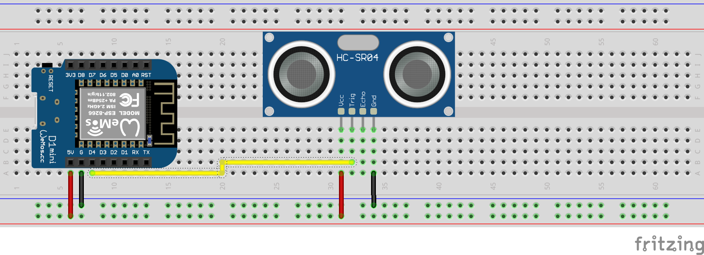

# regenfass

> Bei diesem Projekt geht es um einen intelligenten Wassertank. Es misst den Wasserstand und sendet die Daten an einen Server. Über den Server kann die Wasserpumpe gesteuert werden. Die Steuerung der Pumpe kann über ein Webinterface oder über einen Telegram-Bot erfolgen. Zur Messung des Wasserstands kommt ein Ultraschallsensor HC-SR04 zum Einsatz. Die Daten werden über ein LoRaWAN-Gateway an TTN gesendet.

?> Das Originaldokument wurde verfasst[Englisch](README.md). Die Übersetzung erfolgte mit Google Translate. Wenn Sie Fehler finden, versuchen Sie diese bitte zu ignorieren. Danke schön!

* * *

## Inhaltsverzeichnis

1.  **Schnellstart**
    1.  Einführung
    2.  Hardware
    3.  Flash-Software
2.  **Hardware**
    1.  Sensoren
    2.  Stromversorgung
    3.  Gehäuse
    4.  Mikrocontroller
    5.  Gateway (optional)
3.  **Zusammenbau**
    1.  Sensor zum Controller
    2.  Strom zum Controller
    3.  Fehlerbehebung
4.  **Aufstellen**
    1.  TTN
        1.  Benutzerkonto erstellen
        2.  App erstellen
        3.  Decoder konfigurieren
        4.  Anmeldeinformationen kopieren
    2.  Gerät
        1.  Treiber herunterladen
        2.  Blinkt
        3.  Aufbau
5.  **Debuggen**
    1.  Serieller Monitor
    2.  TTN-Konsole
    3.  MQTT-Client
    4.  Tücken
6.  **Datentechnik**
    1.  Knoten ROT
    2.  Grafana
    3.  Alexa-Skill
    4.  Azure Connect

* * *

## Schnellstart

### Schnellstart – Einführung

Der Schnellstart richtet sich an Personen, die sofort loslegen und fundierte Kenntnisse über IoT mit dem Arudino Framework erwerben möchten. Wenn Sie verstehen möchten, wie es funktioniert, können Sie das lesen[Dokumentation](#hardware).

### Schnellstart – Hardware-Übersicht

You need the following parts:

-   Mikrocontroller mit LoRa-Chip
-   Sensor
-   Stromversorgung
-   Gehäuse

?> Wenn Sie mehr über die Teile erfahren möchten, können Sie die lesen[Hardware-Dokumentation](#Hardware).

### Schnellstart – Flash-Software

1.  Verbinden Sie Ihr Board mit Ihrem Computer und
2.  Klicken Sie auf die folgende Schaltfläche:

<esp-web-install-button manifest="/static/firmware_build/manifest.json"></esp-web-install-button>

?> Wenn Sie mehr über den Flash-Vorgang erfahren möchten, können Sie die lesen[Setup-Dokumentation](#Setup).

## Hardware

1.  [Sensoren](#Sensors)
2.  [Stromversorgung](#Power-supply)
3.  [Gehäuse](#Housing)
4.  [Mikrocontroller](#Microcontroller)
5.  [Tor](#Gateway)

### Sensoren

Um den Wasserstand zu messen, benötigen Sie einen Sensor. Es ist keine leichte Aufgabe, einen wasserdichten Sensor zu finden, der in einem Wassertank verwendet werden kann. Folgende Sensoren werden unterstützt und empfohlen:

#### Anfänger

Wenn Sie ein Anfänger sind, empfehlen wir Ihnen, für den Bau Ihres ersten Prototyps günstige Sensoren zu verwenden. Folgende Sensoren werden unterstützt und empfohlen:

| Teil                                                | Beschreibung                                                                                                                                                                                                                                                                                                                                                                                                                                                                                                                                                                                                                                                                                                                                                                                                                                                                                                              |
| --------------------------------------------------- | ------------------------------------------------------------------------------------------------------------------------------------------------------------------------------------------------------------------------------------------------------------------------------------------------------------------------------------------------------------------------------------------------------------------------------------------------------------------------------------------------------------------------------------------------------------------------------------------------------------------------------------------------------------------------------------------------------------------------------------------------------------------------------------------------------------------------------------------------------------------------------------------------------------------------- |
|  | [HC-SR04 Ultraschallsensor](https://amzn.to/3MHNrbJ)Der Sensor ist relativ günstig und einfach zu bedienen. Es ist nicht wasserdicht. Sie müssen es in ein wasserdichtes Gehäuse stecken. Wir empfehlen diesen Sensor, wenn Sie ihn einfach ausprobieren möchten. Es wird nicht für den Langzeitgebrauch empfohlen. Der**HC-SR04**Sensor ist ein Ultraschallsensor zur Abstandsmessung. Es sendet hochfrequente Schallwellen aus und erkennt die Zeit, die die Wellen benötigen, um nach dem Auftreffen auf ein Objekt zurückzuprallen. Aus dieser Zeit wird dann der Abstand zwischen Sensor und Objekt berechnet. Er hat eine Reichweite von bis zu 4 Metern und kann mit Mikrocontrollern wie Arduino, Raspberry Pi usw. verbunden werden. Der HC-SR04 wird häufig in der Robotik, Automatisierung, Sicherheitssystemen und anderen Anwendungen verwendet, die eine genaue und zuverlässige Abstandsmessung erfordern. |
|              | [BL6180X](https://amzn.to/3zVEFPM)Der Flugzeitsensor ist relativ günstig und einfach zu verwenden. Das Laser-Distanzmodul VL6180X ist ein Sensor, der mithilfe eines Lasers den Abstand zwischen dem Sensor und einem Objekt misst. Es handelt sich um einen Flugzeitsensor (ToF), das heißt, er misst die Zeit, die das Laserlicht benötigt, um von einem Objekt abzuprallen und zum Sensor zurückzukehren. Der Sensor ist nicht wasserdicht, hat aber eine höhere Genauigkeit. Sie müssen es in ein wasserdichtes Gehäuse stecken. Wir empfehlen diesen Sensor, wenn Sie ihn einfach ausprobieren möchten. Es wird nicht für den Langzeitgebrauch empfohlen.                                                                                                                                                                                                                                                            |

#### Fortschrittlich

Wenn Sie dieses Projekt über einen längeren Zeitraum nutzen möchten, empfehlen wir die Verwendung teurerer Sensoren. Folgende Sensoren werden unterstützt und empfohlen:

| Teil                                                                   | Beschreibung                                                                                                                                                                                                                                                                                                                                                                                                                                                                                                                                                                                                                                                                                                                                                                                                                                                                                                                                                                                                                                                                                                                                                                                                                                                                                      |
| ---------------------------------------------------------------------- | ------------------------------------------------------------------------------------------------------------------------------------------------------------------------------------------------------------------------------------------------------------------------------------------------------------------------------------------------------------------------------------------------------------------------------------------------------------------------------------------------------------------------------------------------------------------------------------------------------------------------------------------------------------------------------------------------------------------------------------------------------------------------------------------------------------------------------------------------------------------------------------------------------------------------------------------------------------------------------------------------------------------------------------------------------------------------------------------------------------------------------------------------------------------------------------------------------------------------------------------------------------------------------------------------- |
|                    | [Kontaktieren Sie den Wasserstandsensor](https://amzn.to/41sKAaL)Dieser Sensor nutzt optische Prinzipien zur Erkennung von Flüssigkeitsständen und wird als fotoelektrischer Wasser-Flüssigkeitsstandsensor bezeichnet. Ein großer Vorteil dieses Sensortyps ist seine hervorragende Empfindlichkeit und das Fehlen mechanischer Teile, was zu einer selteneren Kalibrierung führt. Die Sensorsonde selbst ist klein und hinsichtlich der Platzierungsausrichtung flexibel, sodass sie eine Vielzahl von Bedingungen wie verschüttete Lösung, Trockenheit und horizontale Ebene erkennen kann. Darüber hinaus kann dieser Sensor als Erinnerungs- und Alarmsystem fungieren. Das Gerät verfügt über eine eingebaute emittierende Diode und einen Fototransistor, wobei der geladene Teil vollständig von der kontrollierten Flüssigkeit isoliert ist, was die Sicherheit gewährleistet.                                                                                                                                                                                                                                                                                                                                                                                                           |
|  | [Wasserdichter Ultraschallsensor](https://amzn.to/3MNk4F2)Das JSN-SR04T ist ein Ultraschallsensormodul, das Sonartechnologie zur Erkennung der Entfernung von Objekten nutzt. Dieses kompakte und benutzerfreundliche Modul zeichnet sich durch hohe Genauigkeit und Zuverlässigkeit aus und ist somit die ideale Wahl für eine Vielzahl von Anwendungen, darunter Robotik, Automatisierung und Sicherheitssysteme. Der Sensor hat eine Erfassungsreichweite von bis zu 5 Metern und kann Objekte in einem Winkel von 15 Grad erkennen. Es arbeitet mit einer Frequenz von 40 kHz und hat eine Auflösung von 1 cm. Das Modul verfügt außerdem über eine integrierte Temperaturkompensationsfunktion, die auch bei schwankenden Temperaturbedingungen stabile und genaue Messwerte gewährleistet.**Der JSN-SR04T**Das Modul verfügt über ein wasser- und staubdichtes Gehäuse und eignet sich daher für den Einsatz in rauen Umgebungen. Es ist einfach zu installieren und lässt sich über seine einfache dreipolige Schnittstelle nahtlos in eine Vielzahl von Mikrocontrollern wie Arduino und Raspberry Pi integrieren. Insgesamt ist das Ultraschallsensormodul JSN-SR04T eine ausgezeichnete Wahl für alle, die eine zuverlässige und genaue Entfernungsmesslösung für ihre Projekte suchen. |

### Stromversorgung

Um den Mikrocontroller mit Strom zu versorgen, benötigen Sie ein Netzteil. Der 18650-Akku ist die beste Option. Es ist günstig und kann mit einem Solarpanel aufgeladen werden. Sie können aber auch eine Powerbank oder ein USB-Netzteil verwenden.

| Teil                                                    | Beschreibung                                                                                                                                                                                                                                                                                                                                                                                                                                                                                                                                                                                                                                                                                                                                                                                                                                                                                                                                                                                                    |
| ------------------------------------------------------- | --------------------------------------------------------------------------------------------------------------------------------------------------------------------------------------------------------------------------------------------------------------------------------------------------------------------------------------------------------------------------------------------------------------------------------------------------------------------------------------------------------------------------------------------------------------------------------------------------------------------------------------------------------------------------------------------------------------------------------------------------------------------------------------------------------------------------------------------------------------------------------------------------------------------------------------------------------------------------------------------------------------- |
|     | Es gibt viele Arten von Batterien. Am häufigsten sind Lithium-Ionen, Lithium-Polymer und Lithium-Eisenphosphat. Der**18650 Batterie**ist ein Lithium-Ionen-Akku. Es ist die beste Option für dieses Projekt. Es ist günstig und kann mit einem Solarpanel aufgeladen werden. Es besteht aus Lithium-Ionen und kann bis zu 500 Mal aufgeladen werden. Der 18650-Akku hat eine Spannung von 3,7 V und kann eine Kapazität von etwa 2200 mAh haben. Das Solarpanel hat eine Spannung von 5V und eine Leistung von 2W. Das Solarpanel kann den Akku in 3 Stunden aufladen. Unser Sensor benötigt 5V und 100mA. Der Mikrocontroller benötigt 5V und 100mA. Wir benötigen also zwei 18650-Batterien und einen Spannungsregler, um 5 V zu erhalten. Der Akku ist nicht wasserdicht. Sie müssen es in ein wasserdichtes Gehäuse stecken. Achten Sie auch auf hohe Temperaturen. Der Akku kann explodieren, wenn er zu heiß ist. Wir empfehlen diesen Akku, wenn Sie ihn über einen längeren Zeitraum verwenden möchten. |
|  | **Sonnenkollektor:**Da wir uns in unserem Garten befinden, können wir ein Solarpanel nutzen. Es ist wasserdicht und kann auch bei Regen verwendet werden. Es besteht aus polykristallinem Silizium und hat eine Leistung von 2W. Wenn Sie ein Solarpanel kaufen, müssen Sie darauf achten, dass es über einen 5V-Ausgang mit mindestens 400mA verfügt. Um unsere Batterien aufzuladen, benötigen wir einen Laderegler. Glücklicherweise verfügt der Mikrocontroller über einen eingebauten Laderegler. So können wir das Solarpanel direkt nutzen.                                                                                                                                                                                                                                                                                                                                                                                                                                                              |

### Gehäuse

Zum Schutz des Sensors und des Mikrocontrollers benötigen Sie ein Gehäuse. Das Gehäuse muss wasserdicht und ein wenig resistent gegen hohe Temperaturen und UV-Strahlung sein.
Verwenden**PETG**ist gut für Prototypen. Es ist nicht wasserdicht und kann durch UV-Strahlung zerstört werden. Verwenden**PETG**für den Langzeitgebrauch. Es ist wasserdicht und UV-beständig. Sie können auch verwenden**ABS**. Es ist wasserdicht und UV-beständig.

Selbst**Tupperware**ist eine gute Option. Es ist wasserdicht und UV-beständig.

### Mikrocontroller

Der Mikrocontroller ist das Gehirn des Systems. Es ist für die Messung des Wasserstands und die Übermittlung der Daten an den Server verantwortlich. Die folgenden Mikrocontroller werden unterstützt und empfohlen:

| Teil                                                                | Beschreibung                                                                                                                                                                                                                                                                                                                                                                                                                                                                                                                                                                                                                                                                                                                                                                                                                                                                                                                                                                                                                                                                                                                                                                                                                                                                                                                                                                                                                                                                                                                                                                                                                                                                                                                                                                                                                                                                                                                                                                      |
| ------------------------------------------------------------------- | --------------------------------------------------------------------------------------------------------------------------------------------------------------------------------------------------------------------------------------------------------------------------------------------------------------------------------------------------------------------------------------------------------------------------------------------------------------------------------------------------------------------------------------------------------------------------------------------------------------------------------------------------------------------------------------------------------------------------------------------------------------------------------------------------------------------------------------------------------------------------------------------------------------------------------------------------------------------------------------------------------------------------------------------------------------------------------------------------------------------------------------------------------------------------------------------------------------------------------------------------------------------------------------------------------------------------------------------------------------------------------------------------------------------------------------------------------------------------------------------------------------------------------------------------------------------------------------------------------------------------------------------------------------------------------------------------------------------------------------------------------------------------------------------------------------------------------------------------------------------------------------------------------------------------------------------------------------------------------- |
|  | Der[Seamuing SX1262 LoRa-Modul 868](https://amzn.to/3UFRGq5)ist ein Mikrocontroller mit einem LoRa-Modul. Es ist kostengünstig und einfach zu verwenden. Der SX1262 ist ein hochintegrierter Transceiver mit geringem Stromverbrauch und großer Reichweite, der für den Einsatz in einer Vielzahl von drahtlosen Kommunikationsanwendungen entwickelt wurde. Es verfügt über einen Modus mit extrem niedrigem Stromverbrauch, der es ideal für batteriebetriebene Anwendungen macht, die eine lange Batterielebensdauer erfordern. Der SX1262 nutzt die LoRa-Modulationstechnik, die eine Kommunikation über große Entfernungen bei minimalem Stromverbrauch ermöglicht. Mit einer Reichweite von bis zu 15 km bei Sichtverbindung und bis zu 2 km in städtischen Umgebungen ist der SX1262 eine ausgezeichnete Wahl für drahtlose Kommunikationsanwendungen mit großer Reichweite. Der Transceiver arbeitet im Frequenzbereich von 860–930 MHz und ist somit mit einer Vielzahl regionaler regulatorischer Anforderungen kompatibel. Es verfügt außerdem über eine hohe Empfindlichkeit von -148 dBm und ermöglicht so eine zuverlässige Kommunikation auch in lauten oder schwach signalreichen Umgebungen. Der SX1262 verfügt über eine hochgradig konfigurierbare Schnittstelle, die eine einfache Integration in eine Vielzahl von Anwendungen ermöglicht. Es verfügt außerdem über einen Standby-Modus mit geringem Stromverbrauch, der den Stromverbrauch reduziert, wenn der Transceiver nicht verwendet wird. Insgesamt ist der SX1262 eine äußerst vielseitige und zuverlässige Transceiver-Lösung, die sich ideal für eine Vielzahl drahtloser Kommunikationsanwendungen eignet, darunter IoT, Smart Metering und industrielle Automatisierung.**Es ist nicht wasserdicht.**Sie müssen es in ein wasserdichtes Gehäuse stecken. Wir empfehlen diesen Mikrocontroller, wenn Sie ihn einfach mal ausprobieren möchten. Es wird nicht für den Langzeitgebrauch empfohlen. |

### Tor

Sehen Sie auf der TTN-Karte nach, ob sich in Ihrer Nähe ein Gateway befindet. Wenn es in Ihrer Nähe kein Gateway gibt, können Sie ein Gateway kaufen, benötigen aber eine Internetverbindung. Das Gateway ist die Brücke zwischen dem Mikrocontroller und dem TTN-Server. Die folgenden Gateways werden unterstützt und empfohlen:

| Teil                                                 | Beschreibung                                                                                                                                                                                                                                                                                                                                                                                                                                                                                                                                                                                                                                                                                                                                                                               |
| ---------------------------------------------------- | ------------------------------------------------------------------------------------------------------------------------------------------------------------------------------------------------------------------------------------------------------------------------------------------------------------------------------------------------------------------------------------------------------------------------------------------------------------------------------------------------------------------------------------------------------------------------------------------------------------------------------------------------------------------------------------------------------------------------------------------------------------------------------------------ |
|  | [TTN-Indoor-Gateway](https://amzn.to/3L1x1JN)Das Gateway ist für die nahtlose Zusammenarbeit mit The Things Network v3 konzipiert, das eine Reihe von Funktionen wie sichere Geräteaktivierung, globale Abdeckung und einfache Geräteverwaltung bietet. Es bietet außerdem integrierte Unterstützung für Bluetooth Low Energy (BLE) und Wi-Fi und ermöglicht so eine einfache Konfiguration und Verwaltung über ein Smartphone oder einen Computer. Insgesamt ist das Things Indoor LoRaWAN Indoor Gateway TTNv3 eine ausgezeichnete Wahl für alle, die ein zuverlässiges, einfach zu bedienendes Gateway für ihr LoRaWAN-Netzwerk suchen. Es ist erschwinglich, energieeffizient und voller Funktionen, die es zur idealen Wahl für kommerzielle und industrielle IoT-Anwendungen machen. |

## 3. Zusammenbau

1.  [Sensor zum Controller](#sensor-to-controller)
2.  [Strom zum Controller](#power-to-controller)
3.  [Fehlerbehebung](#trouble-shooting)

### Sensor zum Controller

Dieses Beispiel zeigt, wie der HC-SR04-Sensor an den Mikrocontroller montiert wird. Der Sensor wird über ein 4-poliges Kabel mit dem Mikrocontroller verbunden. Das gelbe Kabel ist das Auslösekabel. Das blaue Kabel ist das Echokabel. Das rote Kabel ist das 5V-Kabel. Das schwarze Kabel ist das Erdungskabel.

### Strom zum Controller

### Fehlerbehebung

* * *

#### LoRaWAN

-   LoRaWAN-Gateway

#### Mikrocontroller

Es ist offensichtlich, dass Sie ein Board benötigen, um die Software auszuführen. Sie benötigen aber auch einen LoRa-Chip, um die Daten an TTN zu senden. Folgende Boards werden unterstützt:

-   [Auf dem Weg zum Grasen](Hardware/TTGOLoRa32.md)
-   [Heltec LoRa32](Hardware/HeltecLoRa32.md)

### Schematisch

### 3D-gedruckte Teile

## Software

### Arduino

-   [Arduino](Software/Arduino/README.md)

### Server

-   [Server](Software/Server/README.md)

### Telegramm-Bot

-   [Telegramm-Bot](Software/TelegramBot/README.md)

## Beitragen

-   <https://github.com/ttnleipzig/regenfass-hc-sr04/>
-

## Lizenz

[Namensnennung – Nicht kommerziell – Weitergabe unter gleichen Bedingungen 4.0 International (CC BY-NC-SA 4.0)](https://creativecommons.org/licenses/by-nc-sa/4.0/)

**Es steht Ihnen frei:**

-   Teilen – Kopieren und Weiterverbreiten des Materials in einem beliebigen Medium oder Format
-   Anpassen – das Material neu mischen, transformieren und darauf aufbauen

* * *

_Hergestellt mit ❤️ von[dokumentieren](https://docsify.js.org/)_
