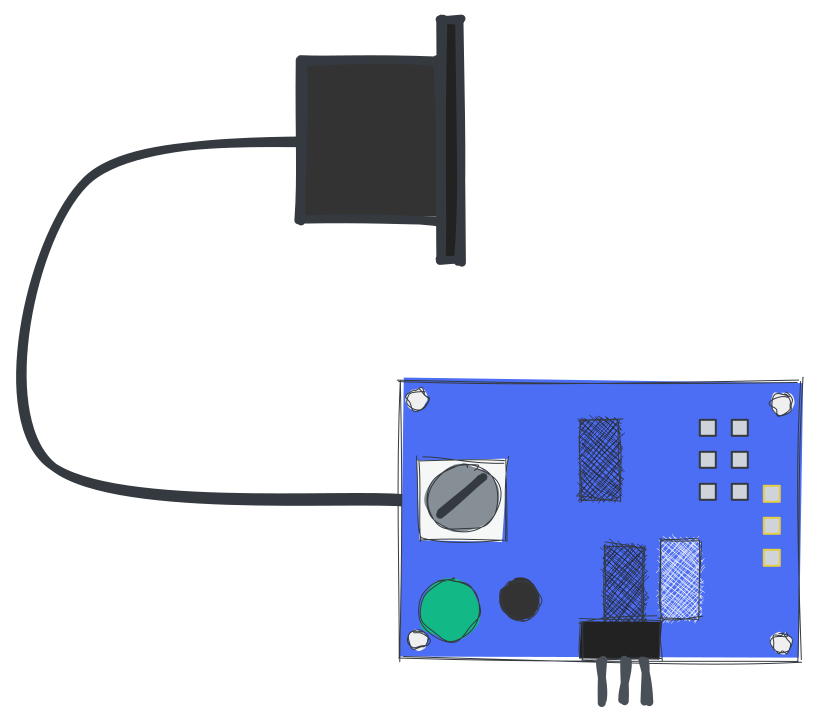

# regenfass

> Bei diesem Projekt geht es um einen intelligenten Wassertank. Es misst den Wasserstand und sendet die Daten an einen Server. Der Server kann zur Steuerung der Wasserpumpe verwendet werden. Die Pumpe kann über ein Webinterface oder über einen Telegrammbot gesteuert werden. Es verwendet einen HC-SR04-Ultraschallsensor, um den Wasserstand zu messen. Die Daten werden über ein LoRaWAN-Gateway an TTN gesendet.

?> Das Originaldokument wurde eingeschrieben[Englisch](README.md). Die Übersetzung wurde mit Google Translate erstellt. Wenn Sie Fehler finden, versuchen Sie bitte, diese zu ignorieren. Danke schön!

* * *

## Inhaltsverzeichnis

1.  **Schnellstart**
    1.  Einführung
    2.  Hardware
    3.  Flash-Software
2.  **Hardware**
    1.  Sensoren
    2.  Stromversorgung
    3.  Gehäuse
    4.  Mikrocontroller
    5.  Gateway (optional)
3.  **Zusammenbauen**
    1.  Sensor zum Steuergerät
    2.  Strom zum Controller
    3.  Fehlerbehebung
4.  **Aufstellen**
    1.  TTN
        1.  Benutzerkonto erstellen
        2.  App erstellen
        3.  Decoder konfigurieren
        4.  Anmeldeinformationen kopieren
    2.  Gerät
        1.  Treiber herunterladen
        2.  Blinkt
        3.  Aufbau
5.  **Debuggen**
    1.  Serieller Monitor
    2.  TTN-Konsole
    3.  MQTT-Client
    4.  Tücken
6.  **Datentechnik**
    1.  Knoten ROT
    2.  Grafana
    3.  Alexa-Skill
    4.  Azure Connect

* * *

## Schnellstart

### Schnellstart - Einführung

Der Quickstart ist für Leute gemacht, die sofort loslegen möchten und tiefes Wissen über IoT mit dem Arudino Framework haben. Wenn Sie verstehen möchten, wie es funktioniert, können Sie die lesen[Dokumentation](#hardware).

### Schnellstart - Hardware-Übersicht

Sie benötigen folgende Teile:

-   Mikrocontroller mit LoRa-Chip
-   Sensor
-   Stromversorgung
-   Gehäuse

?> Wenn Sie mehr über die Teile erfahren möchten, können Sie die lesen[Hardware-Dokumentation](#Hardware).

### Schnellstart - Flash-Software

1.  Verbinden Sie Ihr Board mit Ihrem Computer und
2.  Klicken Sie auf die folgende Schaltfläche:

<esp-web-install-button manifest="/static/firmware_build/manifest.json"></esp-web-install-button>

?> Wenn Sie mehr über den Flash-Vorgang erfahren möchten, können Sie die lesen[Setup-Dokumentation](#Setup).

## Hardware

1.  [Sensoren](#Sensors)
2.  [Stromversorgung](#Power-supply)
3.  [Gehäuse](#Housing)
4.  [Mikrocontroller](#Microcontroller)
5.  [Tor](#Gateway)

### Sensoren

Um den Wasserstand zu messen, benötigen Sie einen Sensor. Es ist keine leichte Aufgabe, einen Sensor zu finden, der wasserdicht ist und in einem Wassertank verwendet werden kann. Folgende Sensoren werden unterstützt und empfohlen:

#### Anfänger

Wenn Sie Anfänger sind, empfehlen wir Ihnen, günstige Sensoren zu verwenden, um Ihren ersten Prototypen zu bauen. Folgende Sensoren werden unterstützt und empfohlen:

| Teil                                                | Beschreibung                                                                                                                                                                                                                                                                                                                                                                                                                                                                                                                                                                                                                                                                                                                                                                                                                                                                                                                |
| --------------------------------------------------- | --------------------------------------------------------------------------------------------------------------------------------------------------------------------------------------------------------------------------------------------------------------------------------------------------------------------------------------------------------------------------------------------------------------------------------------------------------------------------------------------------------------------------------------------------------------------------------------------------------------------------------------------------------------------------------------------------------------------------------------------------------------------------------------------------------------------------------------------------------------------------------------------------------------------------- |
|  | [HC-SR04 Ultraschallsensor](https://amzn.to/3MHNrbJ)Der Sensor ist relativ billig und einfach zu bedienen. Es ist nicht wasserdicht. Sie müssen es in ein wasserdichtes Gehäuse stecken. Wir empfehlen diesen Sensor, wenn Sie ihn nur ausprobieren möchten. Es wird nicht für eine langfristige Anwendung empfohlen. Der**HC-SR04**sensor ist ein Ultraschallsensor zur Entfernungsmessung. Es sendet hochfrequente Schallwellen aus und erkennt die Zeit, die die Wellen benötigen, um nach dem Auftreffen auf ein Objekt zurückzuprallen. Aus dieser Zeit wird dann der Abstand zwischen Sensor und Objekt berechnet. Er hat eine Reichweite von bis zu 4 Metern und kann mit Mikrocontrollern wie Arduino, Raspberry Pi usw. verbunden werden. Der HC-SR04 wird häufig in Robotik, Automatisierung, Sicherheitssystemen und anderen Anwendungen eingesetzt, die eine genaue und zuverlässige Abstandsmessung erfordern. |
|              | [BL6180X](https://amzn.to/3zVEFPM)Der Laufzeitsensor ist relativ billig und einfach zu verwenden. Das Laserdistanzmodul VL6180X ist ein Sensor, der einen Laser verwendet, um die Distanz zwischen dem Sensor und einem Objekt zu messen. Es handelt sich um einen Time-of-Flight (ToF)-Sensor, was bedeutet, dass er die Zeit misst, die das Laserlicht benötigt, um von einem Objekt abzuprallen und zum Sensor zurückzukehren. Der Sensor ist nicht wasserdicht, hat aber eine höhere Genauigkeit. Sie müssen es in ein wasserdichtes Gehäuse stecken. Wir empfehlen diesen Sensor, wenn Sie ihn nur ausprobieren möchten. Es wird nicht für eine langfristige Anwendung empfohlen.                                                                                                                                                                                                                                      |

#### Fortschrittlich

Wenn Sie dieses Projekt längere Zeit verwenden möchten, empfehlen wir die Verwendung teurerer Sensoren. Folgende Sensoren werden unterstützt und empfohlen:

| Teil                                                                   | Beschreibung                                                                                                                                                                                                                                                                                                                                                                                                                                                                                                                                                                                                                                                                                                                                                                                                                                                                                                                                                                                                                                                                                                                                                                                                                                                                                            |
| ---------------------------------------------------------------------- | ------------------------------------------------------------------------------------------------------------------------------------------------------------------------------------------------------------------------------------------------------------------------------------------------------------------------------------------------------------------------------------------------------------------------------------------------------------------------------------------------------------------------------------------------------------------------------------------------------------------------------------------------------------------------------------------------------------------------------------------------------------------------------------------------------------------------------------------------------------------------------------------------------------------------------------------------------------------------------------------------------------------------------------------------------------------------------------------------------------------------------------------------------------------------------------------------------------------------------------------------------------------------------------------------------- |
|                    | [Wasserstandssensor kontaktieren](https://amzn.to/41sKAaL)Dieser Sensor verwendet optische Prinzipien zum Erfassen von Flüssigkeitsständen und ist als photoelektrischer Flüssigkeitsstandssensor für Wasser bekannt. Ein großer Vorteil dieses Sensortyps ist seine hervorragende Empfindlichkeit und das Fehlen mechanischer Teile, was zu einer selteneren Kalibrierung führt. Die Sensorsonde selbst ist klein und flexibel in Bezug auf die Platzierungsausrichtung, sodass sie eine Vielzahl von Bedingungen erkennen kann, z. B. das Verschütten von Lösung, Trockenheit und horizontalen Füllstand. Zusätzlich kann dieser Sensor als Erinnerungs- und Alarmsystem fungieren. Das Gerät verfügt über eine eingebaute Leuchtdiode und einen Fototransistor, wobei der geladene Teil vollständig von der kontrollierten Flüssigkeit isoliert ist, um die Sicherheit zu gewährleisten.                                                                                                                                                                                                                                                                                                                                                                                                             |
|  | [Wasserdichter Ultraschallsensor](https://amzn.to/3MNk4F2)Das JSN-SR04T ist ein Ultraschallsensormodul, das die Sonartechnologie nutzt, um die Entfernung von Objekten zu erkennen. Dieses kompakte und benutzerfreundliche Modul zeichnet sich durch hohe Genauigkeit und Zuverlässigkeit aus und ist damit die ideale Wahl für eine Vielzahl von Anwendungen, darunter Robotik, Automatisierung und Sicherheitssysteme. Der Sensor hat eine Reichweite von bis zu 5 Metern und kann Objekte in einem Winkel von 15 Grad erkennen. Es arbeitet mit einer Frequenz von 40 kHz und hat eine Auflösung von 1 cm. Das Modul enthält auch eine eingebaute Temperaturkompensationsfunktion, die stabile und genaue Messwerte auch bei wechselnden Temperaturbedingungen gewährleistet.**Der JSN-SR04T**Das Modul ist mit einem wasser- und staubdichten Gehäuse ausgestattet, wodurch es für den Einsatz in rauen Umgebungen geeignet ist. Es ist einfach zu installieren und lässt sich über seine einfache dreipolige Schnittstelle nahtlos in eine Vielzahl von Mikrocontrollern wie Arduino und Raspberry Pi integrieren. Insgesamt ist das Ultraschallsensormodul JSN-SR04T eine ausgezeichnete Wahl für alle, die nach einer zuverlässigen und genauen Entfernungsmesslösung für ihre Projekte suchen. |

### Stromversorgung

Um den Mikrocontroller mit Strom zu versorgen, benötigen Sie ein Netzteil. Der 18650 Akku ist die beste Option. Es ist billig und Sie können es mit einem Solarpanel aufladen. Sie können aber auch eine Powerbank oder ein USB-Netzteil verwenden.

| Teil                                                    | Beschreibung                                                                                                                                                                                                                                                                                                                                                                                                                                                                                                                                                                                                                                                                                                                                                                                                                                                                                                                                                                                                    |
| ------------------------------------------------------- | --------------------------------------------------------------------------------------------------------------------------------------------------------------------------------------------------------------------------------------------------------------------------------------------------------------------------------------------------------------------------------------------------------------------------------------------------------------------------------------------------------------------------------------------------------------------------------------------------------------------------------------------------------------------------------------------------------------------------------------------------------------------------------------------------------------------------------------------------------------------------------------------------------------------------------------------------------------------------------------------------------------- |
|     | Es gibt viele Arten von Batterien. Die gebräuchlichsten sind Lithium-Ionen, Lithium-Polymer und Lithium-Eisen-Phosphat. Der**18650er Akku**ist ein Lithium-Ionen-Akku. Es ist die beste Option für dieses Projekt. Es ist billig und Sie können es mit einem Solarpanel aufladen. Es besteht aus Lithium-Ionen und kann bis zu 500 Mal aufgeladen werden. 18650 Akku hat eine Spannung von 3,7 V und kann eine Kapazität von ca. 2200 mAh haben. Das Solarpanel hat eine Spannung von 5V und eine Leistung von 2W. Das Solarpanel kann den Akku in 3 Stunden aufladen. Unser Sensor benötigt 5V und 100mA. Der Mikrocontroller benötigt 5V und 100mA. Wir brauchen also zwei 18650-Batterien und einen Spannungsregler, um 5 V zu erhalten. Der Akku ist nicht wasserdicht. Sie müssen es in ein wasserdichtes Gehäuse stecken. Achten Sie auch auf hohe Temperaturen. Der Akku kann explodieren, wenn er zu heiß wird. Wir empfehlen diesen Akku, wenn Sie ihn über einen längeren Zeitraum verwenden möchten. |
|  | **Sonnenkollektor:**Da wir in unserem Garten sind, können wir ein Solarpanel benutzen. Es ist wasserdicht und kann im Regen verwendet werden. Es besteht aus polykristallinem Silizium und hat eine Leistung von 2W. Wenn Sie ein Solarpanel kaufen, müssen Sie darauf achten, dass es einen 5V-Ausgang mit mindestens 400mA hat. Um unsere Batterien aufzuladen, benötigen wir einen Laderegler. Glücklicherweise hat der Mikrocontroller einen Laderegler eingebaut. So können wir das Solarpanel direkt verwenden.                                                                                                                                                                                                                                                                                                                                                                                                                                                                                           |

### Gehäuse

Zum Schutz des Sensors und des Mikrocontrollers benötigen Sie ein Gehäuse. Das Gehäuse muss wasserdicht und etwas widerstandsfähig gegen hohe Temperaturen und UV-Strahlung sein.
Verwenden**PETG**ist gut für Prototypen. Es ist nicht wasserdicht und kann durch UV-Strahlung zerstört werden. Verwenden**PETG**für den Langzeiteinsatz. Es ist wasserdicht und UV-beständig. Sie können auch verwenden**ABS**. Es ist wasserdicht und UV-beständig.

Selbst**Tupperware**ist eine gute Möglichkeit. Es ist wasserdicht und UV-beständig.

### Mikrocontroller

Der Mikrocontroller ist das Gehirn des Systems. Es ist dafür verantwortlich, den Wasserstand zu messen und die Daten an den Server zu senden. Die folgenden Mikrocontroller werden unterstützt und empfohlen:

| Teil                                                                | Beschreibung                                                                                                                                                                                                                                                                                                                                                                                                                                                                                                                                                                                                                                                                                                                                                                                                                                                                                                                                                                                                                                                                                                                                                                                                                                                                                                                                                                                                                                                                                                                                                                                                                                                                                                                                                                                                                                                                                                                                                            |
| ------------------------------------------------------------------- | ----------------------------------------------------------------------------------------------------------------------------------------------------------------------------------------------------------------------------------------------------------------------------------------------------------------------------------------------------------------------------------------------------------------------------------------------------------------------------------------------------------------------------------------------------------------------------------------------------------------------------------------------------------------------------------------------------------------------------------------------------------------------------------------------------------------------------------------------------------------------------------------------------------------------------------------------------------------------------------------------------------------------------------------------------------------------------------------------------------------------------------------------------------------------------------------------------------------------------------------------------------------------------------------------------------------------------------------------------------------------------------------------------------------------------------------------------------------------------------------------------------------------------------------------------------------------------------------------------------------------------------------------------------------------------------------------------------------------------------------------------------------------------------------------------------------------------------------------------------------------------------------------------------------------------------------------------------------------- |
|  | Der[Seamuing SX1262 LoRa-Modul 868](https://amzn.to/3UFRGq5)ist ein Mikrocontroller mit einem LoRa-Modul. Es ist billig und einfach zu bedienen. Der SX1262 ist ein hochintegrierter Transceiver mit geringem Stromverbrauch und großer Reichweite, der für den Einsatz in einer Vielzahl von drahtlosen Kommunikationsanwendungen entwickelt wurde. Es verfügt über einen Modus mit extrem niedrigem Stromverbrauch, der es ideal für batteriebetriebene Anwendungen macht, die eine lange Batterielebensdauer erfordern. Der SX1262 verwendet die LoRa-Modulationstechnik, die eine Kommunikation über große Entfernungen bei minimalem Stromverbrauch ermöglicht. Mit einer Reichweite von bis zu 15 km bei freier Sicht und bis zu 2 km in städtischen Umgebungen ist der SX1262 eine ausgezeichnete Wahl für drahtlose Kommunikationsanwendungen mit großer Reichweite. Der Transceiver arbeitet im Frequenzbereich von 860 bis 930 MHz, wodurch er mit einer Vielzahl regionaler regulatorischer Anforderungen kompatibel ist. Es verfügt außerdem über eine hohe Empfindlichkeit von -148 dBm, was eine zuverlässige Kommunikation auch in lauten oder schwachen Signalumgebungen ermöglicht. Der SX1262 ist mit einer hochgradig konfigurierbaren Schnittstelle ausgestattet, die eine einfache Integration in eine Vielzahl von Anwendungen ermöglicht. Es verfügt auch über einen stromsparenden Standby-Modus, der den Stromverbrauch reduziert, wenn der Transceiver nicht verwendet wird. Insgesamt ist der SX1262 eine äußerst vielseitige und zuverlässige Transceiver-Lösung, die sich ideal für eine breite Palette von drahtlosen Kommunikationsanwendungen eignet, einschließlich IoT, Smart Metering und Industrieautomation.**Es ist nicht wasserdicht.**Sie müssen es in ein wasserdichtes Gehäuse stecken. Wir empfehlen diesen Mikrocontroller, wenn Sie ihn nur ausprobieren möchten. Es wird nicht für eine langfristige Anwendung empfohlen. |

### Tor

Sehen Sie auf der TTN-Karte nach, ob es ein Gateway in Ihrer Nähe gibt. Wenn es in Ihrer Nähe kein Gateway gibt, können Sie ein Gateway kaufen, aber Sie benötigen eine Internetverbindung. Das Gateway ist die Brücke zwischen dem Mikrocontroller und dem TTN-Server. Die folgenden Gateways werden unterstützt und empfohlen:

| Teil                                                 | Beschreibung                                                                                                                                                                                                                                                                                                                                                                                                                                                                                                                                                                                                                                                                                                                                                                                  |
| ---------------------------------------------------- | --------------------------------------------------------------------------------------------------------------------------------------------------------------------------------------------------------------------------------------------------------------------------------------------------------------------------------------------------------------------------------------------------------------------------------------------------------------------------------------------------------------------------------------------------------------------------------------------------------------------------------------------------------------------------------------------------------------------------------------------------------------------------------------------- |
|  | [TTN Indoor-Gateway](https://amzn.to/3L1x1JN)Das Gateway ist so konzipiert, dass es nahtlos mit The Things Network v3 zusammenarbeitet, das eine Reihe von Funktionen wie sichere Geräteaktivierung, globale Abdeckung und einfache Geräteverwaltung bietet. Es bietet auch integrierte Unterstützung für Bluetooth Low Energy (BLE) und Wi-Fi, was eine einfache Konfiguration und Verwaltung mit einem Smartphone oder Computer ermöglicht. Insgesamt ist das Things Indoor LoRaWAN Indoor Gateway TTNv3 eine ausgezeichnete Wahl für alle, die ein zuverlässiges, einfach zu bedienendes Gateway für ihr LoRaWAN-Netzwerk suchen. Es ist erschwinglich, energieeffizient und vollgepackt mit Funktionen, die es zur idealen Wahl für kommerzielle und industrielle IoT-Anwendungen machen. |

## 3. Zusammenbau

1.  [Sensor zum Steuergerät](#sensor-to-controller)
2.  [Strom zum Controller](#power-to-controller)
3.  [Fehlerbehebung](#trouble-shooting)

### Sensor zum Steuergerät

Dieses Beispiel zeigt, wie der HC-SR04-Sensor am Mikrocontroller montiert wird. Der Sensor wird mit einem 4-Pin-Kabel an den Mikrocontroller angeschlossen. Das gelbe Kabel ist das Auslösekabel. Das blaue Kabel ist das Echokabel. Das rote Kabel ist das 5V-Kabel. Das schwarze Kabel ist das Massekabel.

### Strom zum Controller

### Fehlerbehebung

* * *

#### LoRaWAN

-   LoRaWAN-Gateway

#### Mikrocontroller

Es ist offensichtlich, dass Sie ein Board benötigen, um die Software auszuführen. Sie benötigen aber auch einen LoRa-Chip, um die Daten an TTN zu senden. Folgende Boards werden unterstützt:

-   [Auf dem Weg zum Grasen](Hardware/TTGOLoRa32.md)
-   [Heltec LoRa32](Hardware/HeltecLoRa32.md)

### Schema

### 3D-gedruckte Teile

## Software

### Arduino

-   [Arduino](Software/Arduino/README.md)

### Server

-   [Server](Software/Server/README.md)

### Telegramm-Bot

-   [Telegramm-Bot](Software/TelegramBot/README.md)

## Lizenz

[Namensnennung-Nichtkommerziell-Weitergabe unter gleichen Bedingungen 4.0 International (CC BY-NC-SA 4.0)](https://creativecommons.org/licenses/by-nc-sa/4.0/)

**Es steht Ihnen frei:**

-   Teilen – Kopieren und Weitergeben des Materials in jedem Medium oder Format
-   Anpassen – Material neu mischen, transformieren und darauf aufbauen

* * *

_Hergestellt mit ❤️ von[dokumentieren](https://docsify.js.org/)_
