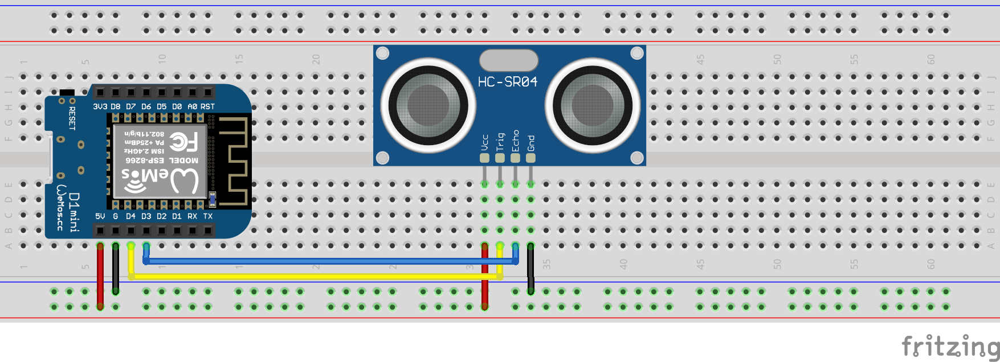

# regenfass

> In diesem Projekt handelt es sich um einen intelligenten Wassertank. Es misst den Wasserstand und sendet die Daten an einen Server. Der Server kann verwendet werden, um die Wasserpumpe zu steuern. Die Pumpe kann über eine Webschnittstelle oder über einen Telegrammbot gesteuert werden. Es verwendet einen HC-SR04-Ultraschallsensor, um den Wasserstand zu messen. Die Daten werden über ein Lorawan -Gateway an TTN gesendet.

?> Das Originaldokument wurde geschrieben in[Englisch](README.md). Die Übersetzung wurde mit Google Translate durchgeführt. Wenn Sie Fehler finden, versuchen Sie bitte, sie zu ignorieren. Danke schön!

* * *

## Inhaltstabelle

1.  **Quickstart**
    1.  Einführung
    2.  Hardware
    3.  Flash -Software
2.  **Hardware**
    1.  Sensoren
    2.  Stromversorgung
    3.  Gehäuse
    4.  Mikrocontroller
    5.  Gateway (optional)
3.  **Zusammenstellung**
    1.  Sensor zu Controller
    2.  Stromversorgung der Controller
    3.  Fehlerbehebung
4.  **Aufstellen**
    1.  Ttn
        1.  Benutzerkonto erstellen
        2.  App erstellen
        3.  Konfigurieren von Decoder
        4.  Anmeldeinformationen kopieren
    2.  Gerät
        1.  Treiber herunterladen
        2.  Blinken
        3.  Konfiguration
5.  **Debuggen**
    1.  Serienmonitor
    2.  TTN -Konsole
    3.  MQTT -Client
    4.  Fallstricke
6.  **Daten Engineering**
    1.  Knoten rot
    2.  Kratzen
    3.  Alexa Fähigkeit
    4.  Azure Connect

* * *

## Schneller Start

### Schneller Start - Einführung

Der QuickStart ist für Menschen gemacht, die sofort anfangen wollen und mit dem Arudino -Framework ein tiefes Wissen über IoT. Wenn Sie verstehen möchten, wie es funktioniert, können Sie das lesen[Dokumentation](#hardware).

### Schnellstart - Hardwareübersicht

Sie brauchen die folgenden Teile:

-   Mikrocontroller mit Lora -Chip
-   Sensor
-   Stromversorgung
-   Gehäuse

?> Wenn Sie mehr über die Teile erfahren möchten, können Sie die lesen[Hardware -Dokumentation](#Hardware).

### Schnellstart - Flash -Software

1.  Schließen Sie Ihr Board an Ihren Computer an und an
2.  Klicken Sie auf die folgende Schaltfläche:

<esp-web-install-button manifest="/static/firmware_build/manifest.json"></esp-web-install-button>

?> Wenn Sie mehr über den Blinkprozess erfahren möchten, können Sie die lesen[Setup -Dokumentation](#Setup).

## Hardware

1.  [Sensoren](#Sensors)
2.  [Stromversorgung](#Power-supply)
3.  [Gehäuse](#Housing)
4.  [Mikrocontroller](#Microcontroller)
5.  [Tor](#Gateway)

### Sensoren

Um den Wasserstand zu messen, benötigen Sie einen Sensor. Es ist keine leichte Aufgabe, einen wasserdichten Sensor zu finden und in einem Wassertank verwendet werden kann. Die folgenden Sensoren werden unterstützt und empfohlen:

#### Anfänger

Wenn Sie ein Anfänger sind, empfehlen wir, billige Sensoren zu verwenden, um Ihren ersten Prototyp zu erstellen. Die folgenden Sensoren werden unterstützt und empfohlen:

| Teil                                                | Beschreibung                                                                                                                                                                                                                                                                                                                                                                                                                                                                                                                                                                                                                                                                                                                                                                                                                                                                                                                                                                    |
| --------------------------------------------------- | ------------------------------------------------------------------------------------------------------------------------------------------------------------------------------------------------------------------------------------------------------------------------------------------------------------------------------------------------------------------------------------------------------------------------------------------------------------------------------------------------------------------------------------------------------------------------------------------------------------------------------------------------------------------------------------------------------------------------------------------------------------------------------------------------------------------------------------------------------------------------------------------------------------------------------------------------------------------------------- |
|  | [HC-SR04 Ultraschallsensor](https://amzn.to/3MHNrbJ)Der Sensor ist relativ billig und einfach zu bedienen. Es ist nicht wasserdicht. Sie müssen es in ein wasserdichtes Gehäuse einfügen. Wir empfehlen diesen Sensor, wenn Sie ihn nur ausprobieren möchten. Es wird für den langfristigen Gebrauch nicht empfohlen. Der**HC-SR04**Der Sensor ist ein Ultraschallsensor, der für die Entfernungsmessung verwendet wird. Es gibt Hochfrequenz -Schallwellen aus und erkennt die Zeit, die die Wellen benötigen, um nach dem Schlagen eines Objekts zurückzuspringen. Diese Zeit wird dann verwendet, um den Abstand zwischen dem Sensor und dem Objekt zu berechnen. Es hat eine Reihe von bis zu 4 Metern und kann mit Mikrocontrollern wie Arduino, Raspberry Pi usw. verbunden werden. Der HC-SR04 wird üblicherweise in Robotik, Automatisierung, Sicherheitssystemen und anderen Anwendungen verwendet, die eine genaue und zuverlässige Entfernungsemerkennung erfordern. |
|              | [VL6180X](https://amzn.to/3zVEFPM)Die Zeit des Flugsensors ist relativ billig und einfach zu bedienen. Das VL6180X -Laserentfernungsmodul ist ein Sensor, der einen Laser verwendet, um den Abstand zwischen dem Sensor und einem Objekt zu messen. Es handelt sich um einen Flugzeitssensor (TOF), was bedeutet, dass es die Zeit misst, die das Laserlicht benötigt, um ein Objekt abzupressen und zum Sensor zurückzukehren. Der Sensor ist nicht wasserdicht, hat aber eine höhere Helligkeit. Sie müssen es in ein wasserdichtes Gehäuse einfügen. Wir empfehlen diesen Sensor, wenn Sie ihn nur ausprobieren möchten. Es wird für den langfristigen Gebrauch nicht empfohlen.                                                                                                                                                                                                                                                                                             |

#### Fortschrittlich

Wenn Sie dieses Projekt für lange Zeit verwenden möchten, empfehlen wir, teurere Sensoren zu verwenden. Die folgenden Sensoren werden unterstützt und empfohlen:

| Teil                                                                   | Beschreibung                                                                                                                                                                                                                                                                                                                                                                                                                                                                                                                                                                                                                                                                                                                                                                                                                                                                                                                                                                                                                                                                                                                                                                                                                                                                                                                                    |
| ---------------------------------------------------------------------- | ----------------------------------------------------------------------------------------------------------------------------------------------------------------------------------------------------------------------------------------------------------------------------------------------------------------------------------------------------------------------------------------------------------------------------------------------------------------------------------------------------------------------------------------------------------------------------------------------------------------------------------------------------------------------------------------------------------------------------------------------------------------------------------------------------------------------------------------------------------------------------------------------------------------------------------------------------------------------------------------------------------------------------------------------------------------------------------------------------------------------------------------------------------------------------------------------------------------------------------------------------------------------------------------------------------------------------------------------- |
|                    | [Kontakt Wasserstandssensor](https://amzn.to/41sKAaL)Dieser Sensor verwendet optische Prinzipien, um den Flüssigkeitsspiegel zu erkennen, und ist als fotoelektrischer Wasserspiegelsensor bekannt. Ein Hauptvorteil dieser Art von Sensor ist die hervorragende Empfindlichkeit und das Fehlen mechanischer Teile, was zu einer geringeren häufigen Kalibrierung führt. Die Sensorsonde selbst ist in Bezug auf die Platzierungsorientierung klein und flexibel, sodass sie eine Vielzahl von Erkrankungen wie Lösungsverschütten, Trockenheit und horizontales Niveau erkennen kann. Zusätzlich kann dieser Sensor als Erinnerungs- und Alarmsystem fungieren. Das Gerät verfügt über eine integrierte emittierende Diode und einen Phototransistor, wobei der geladene Teil vollständig aus der kontrollierten Flüssigkeit isoliert ist, wodurch die Sicherheit gewährleistet ist.                                                                                                                                                                                                                                                                                                                                                                                                                                                           |
|  | [Wasserdichtem Ultraschallsensor](https://amzn.to/3MNk4F2)Das JSN-SR04T ist ein Ultraschallsensormodul, das die Sonar-Technologie verwendet, um den Abstand von Objekten zu erkennen. Dieses kompakte und benutzerfreundliche Modul verfügt über eine hohe Genauigkeit und Zuverlässigkeit und macht es zu einer idealen Wahl für eine Vielzahl von Anwendungen, einschließlich Robotik, Automatisierung und Sicherheitssystemen. Der Sensor hat einen Erkennungsbereich von bis zu 5 Metern und kann Objekte in einem Winkel von 15 Grad erkennen. Es arbeitet mit einer Frequenz von 40 kHz und hat eine Auflösung von 1 cm. Das Modul enthält auch eine eingebaute Temperaturkompensationsfunktion, mit der stabile und genaue Messwerte auch unter unterschiedlichen Temperaturbedingungen sichergestellt werden.**Der JSN-SR04T**Das Modul ist mit einem wasserdichten und staubdichten Gehäuse ausgelegt, wodurch es für die Verwendung in harten Umgebungen geeignet ist. Es ist einfach zu installieren und zu integrieren und integriert sie in einer breiten Palette von Mikrocontrollern wie Arduino und Raspberry Pi über seine einfache Drei-Pin-Schnittstelle. Insgesamt ist das JSN-SR04T-Ultraschallsensormodul eine ausgezeichnete Wahl für alle, die eine zuverlässige und genaue Distanzmesslösung für ihre Projekte suchen. |

### Stromversorgung

Um den Mikrocontroller mit Strom zu versorgen, benötigen Sie eine Stromversorgung. Die Batterie von 18650 ist die beste Option. Es ist billig und Sie können es mit einem Solarpanel aufladen. Sie können aber auch eine Power Bank oder ein USB -Netzteil verwenden.

| Teil                                                    | Beschreibung                                                                                                                                                                                                                                                                                                                                                                                                                                                                                                                                                                                                                                                                                                                                                                                                                                                                                                                                                                                                                  |
| ------------------------------------------------------- | ----------------------------------------------------------------------------------------------------------------------------------------------------------------------------------------------------------------------------------------------------------------------------------------------------------------------------------------------------------------------------------------------------------------------------------------------------------------------------------------------------------------------------------------------------------------------------------------------------------------------------------------------------------------------------------------------------------------------------------------------------------------------------------------------------------------------------------------------------------------------------------------------------------------------------------------------------------------------------------------------------------------------------- |
|     | Es gibt viele Arten von Batterien. Am häufigsten sind Lithiumionen, Lithiumpolymer und Lithiumeisenphosphat. Der**18650 Batterie**ist eine Lithium -Ionen -Batterie. Es ist die beste Option für dieses Projekt. Es ist billig und Sie können es mit einem Solarpanel aufladen. Es besteht aus Lithium -Ion und kann bis zu 500 Mal aufgeladen werden. 18650 Batterie hat eine Spannung von 3,7 V und kann eine Kapazität von Araound 2200mah haben. Das Solarpanel verfügt über eine Spannung von 5 V und eine Leistung von 2W. Das Solarpanel kann die Batterie in 3 Stunden aufladen. Unser Sensor braucht 5 V und 100 mA. Der Mikrocontroller benötigt 5 V und 100 mA. Wir brauchen also zwei 18650 Batterien und einen Spannungsregler, um 5 V zu erhalten. Die Batterie ist nicht wasserdicht. Sie müssen es in ein wasserdichtes Gehäuse einfügen. Achten Sie auch auf hohe Temperaturen. Der Akku kann explodieren, wenn er zu heiß ist. Wir empfehlen diese Batterie, wenn Sie sie für lange Zeit verwenden möchten. |
|  | **Solarpanel:**Da wir in unserem Garten sind, können wir ein Solarpanel verwenden. Es ist wasserdicht und kann im Regen verwendet werden. Es besteht aus polykristallinem Silizium und hat eine Kraft von 2W. Wenn Sie ein Solarpanel kaufen, müssen Sie Shure erstellen, dass es eine 5 -V -Ausgabe mit mindestens 400 mA hat. Um unsere Batterien aufzuladen, benötigen wir einen Ladecontroller. Das Glücksmikrocontroller verfügt über ein Ladungscontroller -Aufbau. Daher können wir das Solarpanel direkt verwenden.                                                                                                                                                                                                                                                                                                                                                                                                                                                                                                   |

### Gehäuse

Um den Sensor und den Mikrocontroller zu schützen, benötigen Sie ein Gehäuse. Das Gehäuse muss wasserdicht und ein wenig gegen hohe Temperaturen und UV -Strahlung bestehen.
Verwenden**Petg**ist gut für Prototypen. Es ist nicht wasserdicht und kann durch UV -Strahlung zerstört werden. Verwenden**Petg**für den langfristigen Gebrauch. Es ist wasserdicht und UV -resistent. Sie können auch verwenden**ABS**. Es ist wasserdicht und UV -resistent.

Sogar**Tupperware**ist eine gute Option. Es ist wasserdicht und UV -resistent.

### Mikrocontroller

Der Mikrocontroller ist das Gehirn des Systems. Es ist verantwortlich für die Messung des Wasserstandes und das Senden der Daten an den Server. Die folgenden Mikrocontroller werden unterstützt und empfohlen:

| Teil                                                                | Beschreibung                                                                                                                                                                                                                                                                                                                                                                                                                                                                                                                                                                                                                                                                                                                                                                                                                                                                                                                                                                                                                                                                                                                                                                                                                                                                                                                                                                                                                                                                                                                                                                                                                                                                      |
| ------------------------------------------------------------------- | --------------------------------------------------------------------------------------------------------------------------------------------------------------------------------------------------------------------------------------------------------------------------------------------------------------------------------------------------------------------------------------------------------------------------------------------------------------------------------------------------------------------------------------------------------------------------------------------------------------------------------------------------------------------------------------------------------------------------------------------------------------------------------------------------------------------------------------------------------------------------------------------------------------------------------------------------------------------------------------------------------------------------------------------------------------------------------------------------------------------------------------------------------------------------------------------------------------------------------------------------------------------------------------------------------------------------------------------------------------------------------------------------------------------------------------------------------------------------------------------------------------------------------------------------------------------------------------------------------------------------------------------------------------------------------- |
|  | Der[SX1262 LORA -Modul 868 angen](https://amzn.to/3UFRGq5) is a microcontroller with a LoRa module. It is cheap and easy to use.The SX1262 is a highly integrated low-power, long-range transceiver designed for use in a variety of wireless communication applications. It features an ultra-low power consumption mode, which makes it ideal for battery-powered applications that require long battery life. The SX1262 utilizes the LoRa modulation technique, which enables long-range communication with minimal power consumption. With a range of up to 15 km in line-of-sight conditions and up to 2 km in urban environments, the SX1262 is an excellent choice for long-range wireless communication applications. The transceiver operates in the 860-930 MHz frequency range, making it compatible with a wide range of regional regulatory requirements. It also features a high sensitivity of -148 dBm, enabling reliable communication even in noisy or weak signal environments. The SX1262 is designed with a highly configurable interface, making it easy to integrate into a wide range of applications. It also features a low-power standby mode, which reduces power consumption when the transceiver is not in use. Overall, the SX1262 is a highly versatile and reliable transceiver solution that is ideal for a wide range of wireless communication applications, including IoT, smart metering, and industrial automation. **Es ist nicht wasserdicht.**Sie müssen es in ein wasserdichtes Gehäuse einfügen. Wir empfehlen diesen Mikrocontroller, wenn Sie es nur ausprobieren möchten. Es wird für den langfristigen Gebrauch nicht empfohlen. |

### Tor

Überprüfen Sie die TTN -Karte, um festzustellen, ob sich ein Tor in Ihrer Nähe befindet. Wenn es in Ihrer Nähe kein Gateway gibt, können Sie ein Gateway kaufen, aber Sie benötigen eine Internetverbindung. Das Gateway ist die Brücke zwischen dem Mikrocontroller und dem TTN -Server. Die folgenden Gateways werden unterstützt und empfohlen:

| Teil                                                 | Beschreibung                                                                                                                                                                                                                                                                                                                                                                                                                                                                                                                                                                                                                                                                                                                                                                                                  |
| ---------------------------------------------------- | ------------------------------------------------------------------------------------------------------------------------------------------------------------------------------------------------------------------------------------------------------------------------------------------------------------------------------------------------------------------------------------------------------------------------------------------------------------------------------------------------------------------------------------------------------------------------------------------------------------------------------------------------------------------------------------------------------------------------------------------------------------------------------------------------------------- |
|  | [TTN Innengateway](https://amzn.to/3L1x1JN)Das Gateway ist so konzipiert, dass sie nahtlos mit dem Things Network V3 zusammenarbeiten, das eine Reihe von Funktionen wie sichere Geräteaktivierung, globale Abdeckung und einfaches Gerätemanagement bietet. Es verfügt außerdem über integrierte Unterstützung für Bluetooth Low Energy (BLE) und Wi-Fi und ermöglicht eine einfache Konfiguration und Verwaltung mithilfe eines Smartphones oder Computers. Insgesamt sind die Dinge in Indoor Lorawan Indoor Gateway TTNV3 eine ausgezeichnete Wahl für alle, die ein zuverlässiges, einfach zu bedienendes Tor für sein Lorawan-Netzwerk suchen. Es ist erschwinglich, energieeffizient und mit Funktionen gefüllt, die es zu einer idealen Wahl für gewerbliche und industrielle IoT-Anwendungen machen. |

## 3.. Versammlung

1.  [Sensor zu Controller](#sensor-to-controller)
2.  [Stromversorgung der Controller](#power-to-controller)
3.  [Fehlerbehebung](#trouble-shooting)

### Sensor zu Controller

Dieses Beispiel zeigt, wie der HC-SR04-Sensor zum Mikrocontroller zusammengestellt wird. Der Sensor ist mit einem 4 -Pin -Kabel an den Mikrocontroller angeschlossen. Das gelbe Kabel ist das Triggerkabel. Das blaue Kabel ist das Echo -Kabel. Das rote Kabel ist das 5 -V -Kabel. Das schwarze Kabel ist das gemahlene Kabel.

### Stromversorgung der Controller

### Fehlerbehebung

* * *

#### Lorawan

-   Lorawan -Tor

#### Mikrocontroller

Es ist offensichtlich, dass Sie ein Board benötigen, um die Software auszuführen. Sie benötigen aber auch einen Lora -Chip, um die Daten an TTN zu senden. Die folgenden Boards werden unterstützt:

-   [Ttgo lora32](Hardware/TTGOLoRa32.md)
-   [HILTEC LORA32](Hardware/HeltecLoRa32.md)

### Schematisch

### 3D-gedruckte Teile

## Software

### Arduino

-   [Arduino](Software/Arduino/README.md)

### Server

-   [Server](Software/Server/README.md)

### Telegram Bot

-   [Telegram Bot](Software/TelegramBot/README.md)

## Beitragen

-   <https://github.com/ttnleipzig/regenfass-hc-sr04/>
-

## Lizenz

[Attribution-Noncommercial-Sharealike 4.0 International (CC BY-NC-SA 4.0)](https://creativecommons.org/licenses/by-nc-sa/4.0/)

**Sie sind frei zu:**

-   Teilen - kopieren und verteilt das Material in jedem Medium oder Format um
-   Anpassen - Remixe, transformieren und bauen auf dem Material auf

* * *

_Gemacht mit ❤️ von[docSify](https://docsify.js.org/)_
