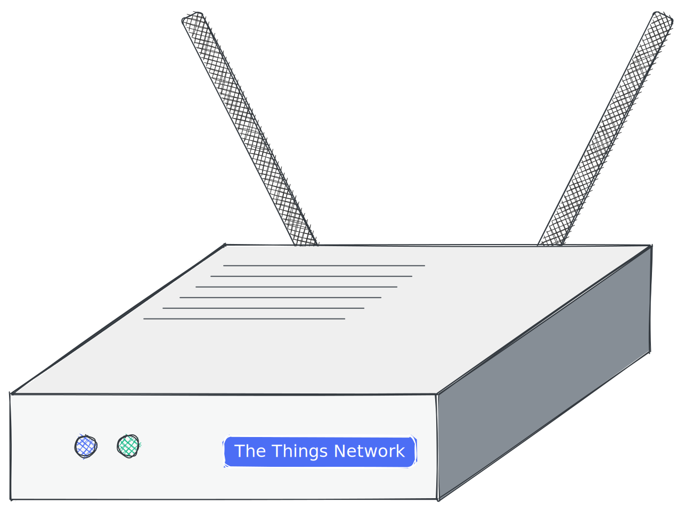

# baril de pluie

> Ce projet concerne un réservoir d'eau intelligent. Il mesure le niveau d'eau et envoie les données à un serveur. Le serveur peut être utilisé pour contrôler la pompe à eau. La pompe peut être contrôlée via une interface Web ou via un bot de télégramme. Il utilise un capteur à ultrasons HC-SR04 pour mesurer le niveau d'eau. Les données sont envoyées à TTN via une passerelle LoRaWAN.

?> Le document original a été rédigé en[Anglais](README.md). La traduction a été faite avec Google Translate. Si vous trouvez des erreurs, essayez de les ignorer. Merci!

* * *

## Table des matières

1.  **Démarrage rapide**
    1.  Introduction
    2.  Matériel
    3.  Logiciel flash
2.  **Matériel**
    1.  Capteurs
    2.  Source de courant
    3.  Logement
    4.  Microcontrôleur
    5.  Passerelle (facultatif)
3.  **Assemblage**
    1.  Capteur vers contrôleur
    2.  Alimentation du contrôleur
    3.  Dépannage
4.  **Installation**
    1.  NTT
        1.  Créer un compte
        2.  Créer une application
        3.  Configurer le décodeur
        4.  Copier les informations d'identification
    2.  Appareil
        1.  Télécharger le pilote
        2.  Clignotant
        3.  Configuration
5.  **Débogage**
    1.  Moniteur série
    2.  Console TTN
    3.  Client MQTT
    4.  Pièges
6.  **Ingénierie des données**
    1.  Nœud ROUGE
    2.  Grafana
    3.  Compétence Alexa
    4.  Azure Connect

* * *

## Démarrage rapide

### Démarrage rapide - Présentation

Le démarrage rapide est fait pour les personnes qui veulent commencer tout de suite et avoir une connaissance approfondie de l'IoT avec le Framework Arudino. Si vous voulez comprendre comment cela fonctionne, vous pouvez lire le[Documentation](#hardware).

### Démarrage rapide - Présentation du matériel

Vous avez besoin des pièces suivantes :

-   Microcontrôleur avec puce LoRa
-   Capteur
-   Source de courant
-   Logement

?> Si vous voulez en savoir plus sur les pièces, vous pouvez lire le[documentation sur le matériel](#Hardware).

### Démarrage rapide - Logiciel Flash

1.  Connectez votre carte à votre ordinateur et
2.  Cliquez sur le bouton suivant :

<esp-web-install-button manifest="/static/firmware_build/manifest.json"></esp-web-install-button>

?> Si vous voulez en savoir plus sur le processus de clignotement, vous pouvez lire le[documentation d'installation](#Setup).

## Matériel

1.  [Capteurs](#Sensors)
2.  [Source de courant](#Power-supply)
3.  [Logement](#Housing)
4.  [Microcontrôleur](#Microcontroller)
5.  [Antenne](#Antenna)

### Capteurs

Pour mesurer le niveau d'eau, vous avez besoin d'un capteur. Il n'est pas facile de trouver un capteur étanche et pouvant être utilisé dans un réservoir d'eau. Les capteurs suivants sont pris en charge et recommandés :

#### Débutant

Si vous êtes débutant, nous vous recommandons d'utiliser des capteurs bon marché pour construire votre premier prototype. Les capteurs suivants sont pris en charge et recommandés :

| Partie                                              | Description                                                                                                                                                                                                                                                                                                                                                                                                                                                                                                                                                                                                                                                                                                                                                                                                                                                                                                                                  |
| --------------------------------------------------- | -------------------------------------------------------------------------------------------------------------------------------------------------------------------------------------------------------------------------------------------------------------------------------------------------------------------------------------------------------------------------------------------------------------------------------------------------------------------------------------------------------------------------------------------------------------------------------------------------------------------------------------------------------------------------------------------------------------------------------------------------------------------------------------------------------------------------------------------------------------------------------------------------------------------------------------------- |
|  | [Capteur à ultrasons HC-SR04](https://amzn.to/3MHNrbJ)Le capteur est relativement bon marché et facile à utiliser. Il n'est pas étanche. Il faut le mettre dans un boîtier étanche. Nous recommandons ce capteur si vous voulez simplement l'essayer. Il n'est pas recommandé pour une utilisation à long terme. Le**HC-SR04**Le capteur est un capteur à ultrasons utilisé pour la mesure de distance. Il émet des ondes sonores à haute fréquence et détecte le temps nécessaire aux ondes pour rebondir après avoir heurté un objet. Ce temps est ensuite utilisé pour calculer la distance entre le capteur et l'objet. Il a une portée allant jusqu'à 4 mètres et peut être interfacé avec des microcontrôleurs comme Arduino, Raspberry Pi, etc. Le HC-SR04 est couramment utilisé dans la robotique, l'automatisation, les systèmes de sécurité et d'autres applications qui nécessitent une détection de distance précise et fiable. |
|              | [BL6180X](https://amzn.to/3zVEFPM)Le capteur de temps de vol est relativement bon marché et facile à utiliser. Le module de distance laser VL6180X est un capteur qui utilise un laser pour mesurer la distance entre le capteur et un objet. Il s'agit d'un capteur de temps de vol (ToF), ce qui signifie qu'il mesure le temps nécessaire à la lumière laser pour rebondir sur un objet et revenir au capteur. Le capteur n'est pas étanche mais a une plus grande précision. Il faut le mettre dans un boîtier étanche. Nous recommandons ce capteur si vous voulez simplement l'essayer. Il n'est pas recommandé pour une utilisation à long terme.                                                                                                                                                                                                                                                                                     |

#### Avancé

Si vous souhaitez utiliser ce projet pendant une longue période, nous vous recommandons d'utiliser des capteurs plus coûteux. Les capteurs suivants sont pris en charge et recommandés :

| Partie                                                                 | Description                                                                                                                                                                                                                                                                                                                                                                                                                                                                                                                                                                                                                                                                                                                                                                                                                                                                                                                                                                                                                                                                                                                                                                                                                                                                                                                               |
| ---------------------------------------------------------------------- | ----------------------------------------------------------------------------------------------------------------------------------------------------------------------------------------------------------------------------------------------------------------------------------------------------------------------------------------------------------------------------------------------------------------------------------------------------------------------------------------------------------------------------------------------------------------------------------------------------------------------------------------------------------------------------------------------------------------------------------------------------------------------------------------------------------------------------------------------------------------------------------------------------------------------------------------------------------------------------------------------------------------------------------------------------------------------------------------------------------------------------------------------------------------------------------------------------------------------------------------------------------------------------------------------------------------------------------------- |
|                    | [Contacter le capteur de niveau d'eau](https://amzn.to/41sKAaL)Ce capteur utilise des principes optiques pour détecter les niveaux de liquide et est connu sous le nom de capteur photoélectrique de niveau de liquide d'eau. Un avantage majeur de ce type de capteur est son excellente sensibilité et l'absence de pièces mécaniques, ce qui conduit à un étalonnage moins fréquent. La sonde du capteur elle-même est petite et flexible en termes d'orientation de placement, ce qui lui permet de détecter une variété de conditions telles que le déversement de solution, la sécheresse et le niveau horizontal. De plus, ce capteur peut fonctionner comme un rappel et un système d'alarme. L'appareil comprend une diode électroluminescente et un phototransistor intégrés, la partie chargée étant complètement isolée du liquide contrôlé, garantissant la sécurité.                                                                                                                                                                                                                                                                                                                                                                                                                                                        |
|  | [Capteur à ultrasons étanche à l'eau](https://amzn.to/3MNk4F2)Le JSN-SR04T est un module de capteur à ultrasons qui utilise la technologie sonar pour détecter la distance des objets. Ce module compact et facile à utiliser offre une précision et une fiabilité élevées, ce qui en fait un choix idéal pour une large gamme d'applications, notamment la robotique, l'automatisation et les systèmes de sécurité. Le capteur a une portée de détection allant jusqu'à 5 mètres et peut détecter des objets dans un angle de 15 degrés. Il fonctionne à une fréquence de 40 kHz et a une résolution de 1 cm. Le module comprend également une fonction de compensation de température intégrée, garantissant des lectures stables et précises même dans des conditions de température variables.**Le JSN-SR04T**Le module est conçu avec un boîtier étanche à l'eau et à la poussière, ce qui le rend adapté à une utilisation dans des environnements difficiles. Il est facile à installer et s'intègre parfaitement à une large gamme de microcontrôleurs, tels que Arduino et Raspberry Pi, grâce à sa simple interface à trois broches. Dans l'ensemble, le module de capteur à ultrasons JSN-SR04T est un excellent choix pour tous ceux qui recherchent une solution de mesure de distance fiable et précise pour leurs projets. |

### Source de courant

Pour alimenter le microcontrôleur, vous avez besoin d'une alimentation. La batterie 18650 est la meilleure option. Il est bon marché et vous pouvez le recharger avec un panneau solaire. Mais vous pouvez également utiliser une banque d'alimentation ou une alimentation USB.

| Partie                                                  | Description                                                                                                                                                                                                                                                                                                                                                                                                                                                                                                                                                                                                                                                                                                                                                                                                                                                                                                                                                                                                                                  |
| ------------------------------------------------------- | -------------------------------------------------------------------------------------------------------------------------------------------------------------------------------------------------------------------------------------------------------------------------------------------------------------------------------------------------------------------------------------------------------------------------------------------------------------------------------------------------------------------------------------------------------------------------------------------------------------------------------------------------------------------------------------------------------------------------------------------------------------------------------------------------------------------------------------------------------------------------------------------------------------------------------------------------------------------------------------------------------------------------------------------- |
|     | Il existe de nombreux types de piles. Les plus courants sont le Lithium Ion, le Lithium Polymère et le Lithium Fer Phosphate. Le**Batterie 18650**est une batterie lithium-ion. C'est la meilleure option pour ce projet. Il est bon marché et vous pouvez le recharger avec un panneau solaire. Il est composé de lithium-ion et peut être rechargé jusqu'à 500 fois. La batterie 18650 a une tension de 3,7 V et peut avoir une capacité d'environ 2200 mAh. Le panneau solaire a une tension de 5V et une puissance de 2W. Le panneau solaire peut charger la batterie en 3 heures. Notre capteur a besoin de 5V et 100mA. Le microcontrôleur a besoin de 5V et 100mA. Nous avons donc besoin de deux batteries 18650 et d'un régulateur de tension pour obtenir 5V. La batterie n'est pas étanche. Il faut le mettre dans un boîtier étanche. Attention également aux températures élevées. La batterie peut exploser si elle est trop chaude. Nous recommandons cette batterie si vous souhaitez l'utiliser pendant une longue période. |
|  | **Panneau solaire:**Puisque nous sommes dans notre jardin, nous pouvons utiliser un panneau solaire. Il est étanche et peut être utilisé sous la pluie. Il est composé de silicium polycristallin et a une puissance de 2W. Si vous achetez un panneau solaire, vous devez vous assurer qu'il a une sortie 5V avec au moins 400mA. Pour recharger nos batteries, nous avons besoin d'un contrôleur de charge. Heureusement, le microcontrôleur a un contrôleur de charge intégré. Nous pouvons donc utiliser directement le panneau solaire.                                                                                                                                                                                                                                                                                                                                                                                                                                                                                                 |

### Logement

Pour protéger le capteur et le microcontrôleur, vous avez besoin d'un boîtier. Le boîtier doit être étanche et un peu résistant aux hautes températures et aux rayons UV.
Utiliser**PETG**est bon pour les prototypes. Il n'est pas étanche et peut être détruit par les rayons UV. Utiliser**PETG**pour une utilisation à long terme. Il est étanche et résistant aux UV. Vous pouvez aussi utiliser**abdos**. Il est étanche et résistant aux UV.

Même**tupperware**est une bonne option. Il est étanche et résistant aux UV.

### Microcontrôleur

Le microcontrôleur est le cerveau du système. Il est chargé de mesurer le niveau d'eau et d'envoyer les données au serveur. Les microcontrôleurs suivants sont pris en charge et recommandés :

| Partie                                                              | Description                                                                                                                                                                                                                                                                                                                                                                                                                                                                                                                                                                                                                                                                                                                                                                                                                                                                                                                                                                                                                                                                                                                                                                                                                                                                                                                                                                                                                                                                                                                                                                                                                                                                                                                                                                                                                                                                                                                                  |
| ------------------------------------------------------------------- | -------------------------------------------------------------------------------------------------------------------------------------------------------------------------------------------------------------------------------------------------------------------------------------------------------------------------------------------------------------------------------------------------------------------------------------------------------------------------------------------------------------------------------------------------------------------------------------------------------------------------------------------------------------------------------------------------------------------------------------------------------------------------------------------------------------------------------------------------------------------------------------------------------------------------------------------------------------------------------------------------------------------------------------------------------------------------------------------------------------------------------------------------------------------------------------------------------------------------------------------------------------------------------------------------------------------------------------------------------------------------------------------------------------------------------------------------------------------------------------------------------------------------------------------------------------------------------------------------------------------------------------------------------------------------------------------------------------------------------------------------------------------------------------------------------------------------------------------------------------------------------------------------------------------------------------------- |
|  | Le[Seamuing SX1262 Module LoRa 868](https://amzn.to/3UFRGq5)est un microcontrôleur avec un module LoRa. Il est bon marché et facile à utiliser. Le SX1262 est un émetteur-récepteur longue portée basse consommation hautement intégré conçu pour être utilisé dans une variété d'applications de communication sans fil. Il dispose d'un mode de consommation d'énergie ultra-faible, ce qui le rend idéal pour les applications alimentées par batterie qui nécessitent une longue durée de vie de la batterie. Le SX1262 utilise la technique de modulation LoRa, qui permet une communication longue portée avec une consommation d'énergie minimale. Avec une portée allant jusqu'à 15 km en visibilité directe et jusqu'à 2 km en milieu urbain, le SX1262 est un excellent choix pour les applications de communication sans fil longue portée. L'émetteur-récepteur fonctionne dans la gamme de fréquences 860-930 MHz, ce qui le rend compatible avec un large éventail d'exigences réglementaires régionales. Il présente également une sensibilité élevée de -148 dBm, permettant une communication fiable même dans des environnements de signal bruyants ou faibles. Le SX1262 est conçu avec une interface hautement configurable, ce qui facilite son intégration dans une large gamme d'applications. Il dispose également d'un mode veille à faible consommation d'énergie, qui réduit la consommation d'énergie lorsque l'émetteur-récepteur n'est pas utilisé. Dans l'ensemble, le SX1262 est une solution d'émetteur-récepteur extrêmement polyvalente et fiable, idéale pour une large gamme d'applications de communication sans fil, notamment l'IoT, les compteurs intelligents et l'automatisation industrielle.**Il n'est pas étanche.**Il faut le mettre dans un boîtier étanche. Nous recommandons ce microcontrôleur si vous voulez juste l'essayer. Il n'est pas recommandé pour une utilisation à long terme. |

### passerelle

Vérifiez la carte TTN pour voir s'il y a une passerelle près de chez vous. S'il n'y a pas de passerelle près de chez vous, vous pouvez acheter une passerelle mais vous avez besoin d'une connexion Internet. La passerelle est le pont entre le microcontrôleur et le serveur TTN. Les passerelles suivantes sont prises en charge et recommandées :

| Partie                                               | Description                                                                                                                                                                                                                                                                                                                                                                                                                                                                                                                                                                                                                                                                                                                                                                                                                                               |
| ---------------------------------------------------- | --------------------------------------------------------------------------------------------------------------------------------------------------------------------------------------------------------------------------------------------------------------------------------------------------------------------------------------------------------------------------------------------------------------------------------------------------------------------------------------------------------------------------------------------------------------------------------------------------------------------------------------------------------------------------------------------------------------------------------------------------------------------------------------------------------------------------------------------------------- |
|  | [Passerelle intérieure TTN](https://amzn.to/3L1x1JN)La passerelle est conçue pour fonctionner de manière transparente avec The Things Network v3, qui offre une gamme de fonctionnalités telles que l'activation sécurisée des appareils, la couverture mondiale et la gestion facile des appareils. Il dispose également d'une prise en charge intégrée du Bluetooth Low Energy (BLE) et du Wi-Fi, permettant une configuration et une gestion faciles à l'aide d'un smartphone ou d'un ordinateur. Dans l'ensemble, la passerelle intérieure Things Indoor LoRaWAN TTNv3 est un excellent choix pour tous ceux qui recherchent une passerelle fiable et facile à utiliser pour leur réseau LoRaWAN. Il est abordable, économe en énergie et doté de fonctionnalités qui en font un choix idéal pour les applications IoT commerciales et industrielles. |

## 3. Assemblage

1.  Capteur vers contrôleur
2.  Alimentation du contrôleur
3.  Dépannage

* * *

#### LoRaWAN

-   Passerelle LoRaWAN

#### Microcontrôleur

Il est évident que vous avez besoin d'une carte pour exécuter le logiciel. Mais vous avez également besoin d'une puce LoRa pour envoyer les données à TTN. Les cartes suivantes sont prises en charge :

-   [En route pour paître](Hardware/TTGOLoRa32.md)
-   [Heltec LoRa32](Hardware/HeltecLoRa32.md)

### Schématique

### Pièces imprimées en 3D

## Logiciel

### Arduino

-   [Arduino](Software/Arduino/README.md)

### Serveur

-   [Serveur](Software/Server/README.md)

### Robot de télégramme

-   [Robot de télégramme](Software/TelegramBot/README.md)

## Licence

[Attribution-NonCommercial-ShareAlike 4.0 International (CC BY-NC-SA 4.0)](https://creativecommons.org/licenses/by-nc-sa/4.0/)

**Vous êtes libre de :**

-   Partager - copier et redistribuer le matériel sur n'importe quel support ou format
-   Adaptez - remixez, transformez et construisez sur le matériel

* * *

_Réalisé avec ❤️ par[documenter](https://docsify.js.org/)_
