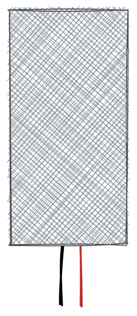

# baril de pluie

> This project is about a smart water tank. It measures the water level and sends the data to a server. The server can be used to control the water pump. The pump can be controlled via a web interface or via a telegram bot. It uses a  HC-SR04 ultrasonic sensor to measure the water level. The data is sent to TTN via a LoRaWAN gateway.

?> Le document original a été rédigé en[Anglais](README.md). La traduction a été faite avec Google Translate. Si vous trouvez des erreurs, essayez de les ignorer. Merci!

* * *

## Table des matières

1.  **Démarrage rapide**
    1.  Introduction
    2.  Matériel
    3.  Logiciel flash
2.  **Matériel**
    1.  Capteurs
    2.  Source de courant
    3.  Logement
    4.  Microcontrôleur
    5.  Antenne
3.  **Assemblage**
    1.  Capteur vers contrôleur
    2.  Alimentation du contrôleur
    3.  Dépannage
4.  **Installation**
    1.  NTT
        1.  Créer un compte
        2.  Créer une application
        3.  Configurer le décodeur
        4.  Copier les informations d'identification
    2.  Appareil
        1.  Télécharger le pilote
        2.  Clignotant
        3.  Configuration
5.  **Débogage**
    1.  Moniteur série
    2.  Console TTN
    3.  Client MQTT
    4.  Pièges
6.  **Ingénierie des données**
    1.  Nœud ROUGE
    2.  Grafana
    3.  Compétence Alexa
    4.  Azure Connect

* * *

## Démarrage rapide

### Rapide - Introduction

Le démarrage rapide est fait pour les personnes qui veulent commencer tout de suite et avoir une connaissance approfondie de l'IoT avec le Framework Arudino. Si vous voulez comprendre comment cela fonctionne, vous pouvez lire le[Documentation](#hardware).

### Rapide - Présentation du matériel

Vous avez besoin des pièces suivantes :

-   Microcontrôleur avec puce LoRa
-   Capteur
-   Source de courant
-   Logement

?> Si vous voulez en savoir plus sur les pièces, vous pouvez lire le[documentation sur le matériel](#Hardware).

### Rapide - Logiciel Flash

1.  Connectez votre carte à votre ordinateur et
2.  Cliquez sur le bouton suivant :

<esp-web-install-button manifest="/static/firmware_build/manifest.json"></esp-web-install-button>

?> Si vous voulez en savoir plus sur le processus de clignotement, vous pouvez lire le[documentation d'installation](#Setup).

## Matériel

1.  [Capteurs](#Sensors)
2.  [Source de courant](#Power-supply)
3.  [Logement](#Housing)
4.  [Microcontrôleur](#Microcontroller)
5.  [Antenne](#Antenna)

### Capteurs

Pour mesurer le niveau d'eau, vous avez besoin d'un capteur. Il n'est pas facile de trouver un capteur étanche et pouvant être utilisé dans un réservoir d'eau. Les capteurs suivants sont pris en charge et recommandés :

| Partie                                                               | Description                                                                                                                                                                                                                                                                                                                                                                                                                |
| -------------------------------------------------------------------- | -------------------------------------------------------------------------------------------------------------------------------------------------------------------------------------------------------------------------------------------------------------------------------------------------------------------------------------------------------------------------------------------------------------------------- |
|  | [Capteur à ultrasons HC-SR04](https://www.amazon.de/gp/product/B07B4J8QZK/ref=ppx_yo_dt_b_asin_title_o00_s00?ie=UTF8&psc=1)Le capteur est relativement bon marché et facile à utiliser. Il n'est pas étanche. Il faut le mettre dans un boîtier étanche. Nous recommandons ce capteur si vous voulez simplement l'essayer. Il n'est pas recommandé pour une utilisation à long terme.                                      |
|                         | [Capteur laser](https://www.amazon.de/gp/product/B07B4J8QZK/ref=ppx_yo_dt_b_asin_title_o00_s00?ie=UTF8&psc=1)Le capteur est relativement bon marché et facile à utiliser. Comme le HC-SRo4, il n'est pas étanche mais a une plus grande précision. Il faut le mettre dans un boîtier étanche. Nous recommandons ce capteur si vous voulez simplement l'essayer. Il n'est pas recommandé pour une utilisation à long terme. |

#### Débutant

-   [Capteur à ultrasons HC-SR04](https://www.amazon.de/gp/product/B07B4J8QZK/ref=ppx_yo_dt_b_asin_title_o00_s00?ie=UTF8&psc=1)
-   [Capteur laser](https://www.amazon.de/gp/product/B07B4J8QZK/ref=ppx_yo_dt_b_asin_title_o00_s00?ie=UTF8&psc=1)

#### Avancé

-   [Capteur d'eau](https://www.amazon.de/gp/product/B07B4J8QZK/ref=ppx_yo_dt_b_asin_title_o00_s00?ie=UTF8&psc=1)
-   [Capteur à ultrasons étanche à l'eau](https://www.amazon.de/gp/product/B07B4J8QZK/ref=ppx_yo_dt_b_asin_title_o00_s00?ie=UTF8&psc=1)

### Source de courant

Pour alimenter le microcontrôleur, vous avez besoin d'une alimentation. La batterie 18650 est la meilleure option. Il est bon marché et vous pouvez le recharger avec un panneau solaire. Mais vous pouvez également utiliser une banque d'alimentation ou une alimentation USB.

| Partie                                                | Description                                                                                                                                                                                                                                                                                                                                                                                                                                                                                                                                                                                                                                                                                                                                                                                                                                                                       |
| ----------------------------------------------------- | --------------------------------------------------------------------------------------------------------------------------------------------------------------------------------------------------------------------------------------------------------------------------------------------------------------------------------------------------------------------------------------------------------------------------------------------------------------------------------------------------------------------------------------------------------------------------------------------------------------------------------------------------------------------------------------------------------------------------------------------------------------------------------------------------------------------------------------------------------------------------------- |
|       | **Batterie 18650 :**La batterie 18650 est la meilleure option. Il est bon marché et vous pouvez le recharger avec un panneau solaire. Il est composé de lithium-ion et peut être rechargé jusqu'à 500 fois. La batterie 18650 a une tension de 3,7 V et peut avoir une capacité d'environ 2200 mAh. Le panneau solaire a une tension de 5V et une puissance de 2W. Le panneau solaire peut charger la batterie en 3 heures. Notre capteur a besoin de 5V et 100mA. Le microcontrôleur a besoin de 5V et 100mA. Nous avons donc besoin de deux batteries 18650 et d'un régulateur de tension pour obtenir 5V. La batterie n'est pas étanche. Il faut le mettre dans un boîtier étanche. Attention également aux températures élevées. La batterie peut exploser si elle est trop chaude. Nous recommandons cette batterie si vous souhaitez l'utiliser pendant une longue période. |
|  | **Panneau solaire:**Le panneau solaire n'est pas nécessaire mais avec la batterie c'est la meilleure option. Le panneau solaire est étanche et peut être utilisé sous la pluie. Il est composé de silicium polycristallin et a une puissance de 2W. Si vous achetez un panneau solaire, vous devez vous assurer qu'il a une sortie 5V avec au moins 400mA.                                                                                                                                                                                                                                                                                                                                                                                                                                                                                                                        |

### Logement

Pour protéger le capteur et le microcontrôleur, vous avez besoin d'un boîtier. Le boîtier doit être étanche et un peu résistant aux hautes températures et aux rayons UV.
Utilisez le PLA uniquement pour les prototypes. Il n'est pas étanche et peut être détruit par les rayons UV. Utilisez l'ABS pour une utilisation à long terme. Il est étanche et résistant aux UV. Vous pouvez également utiliser le PETG. Il est étanche et résistant aux UV. Mais ce n'est pas aussi solide que l'ABS.

Même tupperware est une bonne option. Il est étanche et résistant aux UV.

### Microcontrôleur

Le microcontrôleur est le cerveau du système. Il est chargé de mesurer le niveau d'eau et d'envoyer les données au serveur. Les microcontrôleurs suivants sont pris en charge et recommandés :

| Partie                                             | Description                                                                                                                                                                                                                                                                                                                             |
| -------------------------------------------------- | --------------------------------------------------------------------------------------------------------------------------------------------------------------------------------------------------------------------------------------------------------------------------------------------------------------------------------------- |
|  | **ont tendance à fréquenter :**Le TTGO LoRa32 est un microcontrôleur avec un module LoRa. Il est bon marché et facile à utiliser. Il n'est pas étanche. Il faut le mettre dans un boîtier étanche. Nous recommandons ce microcontrôleur si vous voulez simplement l'essayer. Il n'est pas recommandé pour une utilisation à long terme. |

* * *

| Partie                                                            | Description                                                                                                                 |
| ----------------------------------------------------------------- | --------------------------------------------------------------------------------------------------------------------------- |
|        | [Capteur à ultrasons HC-SR04](https://www.amazon.de/gp/product/B07B4J8QZK/ref=ppx_yo_dt_b_asin_title_o00_s00?ie=UTF8&psc=1) |
|     | [En route pour paître](https://www.amazon.de/gp/product/B07B4J8QZK/ref=ppx_yo_dt_b_asin_title_o00_s00?ie=UTF8&psc=1)        |
|       | Batterie 18650                                                                                                              |
|  | Panneau solaire                                                                                                             |

Les parties suivantes sont des recommandations. Vous pouvez utiliser d'autres pièces si vous le souhaitez. Mais vous devrez peut-être changer le code. Les pièces suivantes sont recommandées :

#### LoRaWAN

-   Passerelle LoRaWAN

#### Microcontrôleur

Il est évident que vous avez besoin d'une carte pour exécuter le logiciel. Mais vous avez également besoin d'une puce LoRa pour envoyer les données à TTN. Les cartes suivantes sont prises en charge :

-   [En route pour paître](Hardware/TTGOLoRa32.md)
-   [Heltec LoRa32](Hardware/HeltecLoRa32.md)

### Schématique

### Pièces imprimées en 3D

## Logiciel

### Arduino

-   [Arduino](Software/Arduino/README.md)

### Serveur

-   [Serveur](Software/Server/README.md)

### Robot de télégramme

-   [Robot de télégramme](Software/TelegramBot/README.md)

## Licence

[Attribution-NonCommercial-ShareAlike 4.0 International (CC BY-NC-SA 4.0)](https://creativecommons.org/licenses/by-nc-sa/4.0/)

**Vous êtes libre de :**

-   Partager - copier et redistribuer le matériel sur n'importe quel support ou format
-   Adaptez - remixez, transformez et construisez sur le matériel

* * *

_Réalisé avec ❤️ par[documenter](https://docsify.js.org/)_
