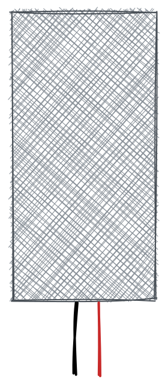

# baril de pluie

> Ce projet concerne un réservoir d'eau intelligent. Il mesure le niveau d'eau et envoie les données à un serveur. Le serveur peut être utilisé pour contrôler la pompe à eau. La pompe peut être contrôlée via une interface Web ou via un bot de télégramme. Il utilise un capteur à ultrasons HC-SR04 pour mesurer le niveau d'eau. Les données sont envoyées à TTN via une passerelle LoRaWAN.

* * *

## Table des matières

1.  **Démarrage rapide**
    1.  Introduction
    2.  Matériel
    3.  Logiciel flash
2.  **Matériel**
    1.  Capteurs
    2.  Source de courant
    3.  Logement
    4.  Microcontrôleur
    5.  Antenne
3.  **Assemblage**
    1.  Capteur vers contrôleur
    2.  Alimentation du contrôleur
    3.  Dépannage
4.  **Installation**
    1.  NTT
        1.  Créer un compte
        2.  Créer une application
        3.  Configurer le décodeur
        4.  Copier les informations d'identification
    2.  Appareil
        1.  Télécharger le pilote
        2.  Clignotant
        3.  Configuration
5.  **Débogage**
    1.  Moniteur série
    2.  Console TTN
    3.  Client MQTT
    4.  Pièges
6.  **Ingénierie des données**
    1.  Nœud ROUGE
    2.  Grafana
    3.  Compétence Alexa
    4.  Azure Connect

* * *

## Démarrage rapide

### Rapide - Introduction

Le quickstart est fait pour les personnes qui veulent commencer tout de suite. Il n'est pas fait pour les personnes qui veulent comprendre comment cela fonctionne. Si vous voulez comprendre comment cela fonctionne, vous pouvez lire le[Documentation](https://ttnleipzig.github.io/regenfass-docs/). Si vous souhaitez commencer tout de suite, vous pouvez suivre les étapes suivantes :

### Rapide - Présentation du matériel

Vous avez besoin des pièces suivantes :

-   Microcontrôleur avec puce LoRa
-   Capteur
-   Source de courant
-   Logement

?> Si vous voulez en savoir plus sur les pièces, vous pouvez lire le[documentation sur le matériel](#Hardware).

### Rapide - Logiciel Flash

1.  Connectez votre carte à votre ordinateur et
2.  Cliquez sur le bouton suivant :

<esp-web-install-button manifest="/static/firmware_build/manifest.json"></esp-web-install-button>

## Matériel

1.  Capteurs
2.  Source de courant
3.  Logement
4.  Microcontrôleur
5.  Antenne

### Capteurs

Pour mesurer le niveau d'eau, vous avez besoin d'un capteur. Il n'est pas facile de trouver un capteur étanche et pouvant être utilisé dans un réservoir d'eau. Les capteurs suivants sont pris en charge et recommandés :
| Partie | Descriptif |
\| --- \| --- \|
\|\|[Capteur à ultrasons HC-SR04](https://www.amazon.de/gp/product/B07B4J8QZK/ref=ppx_yo_dt_b_asin_title_o00_s00?ie=UTF8&psc=1)Le capteur est relativement bon marché et facile à utiliser. Il n'est pas étanche. Il faut le mettre dans un boîtier étanche. Nous recommandons ce capteur si vous voulez simplement l'essayer. Il n'est pas recommandé pour une utilisation à long terme. |
\|\|[Capteur laser](https://www.amazon.de/gp/product/B07B4J8QZK/ref=ppx_yo_dt_b_asin_title_o00_s00?ie=UTF8&psc=1)Le capteur est relativement bon marché et facile à utiliser. Comme le HC-SRo4, il n'est pas étanche mais a une plus grande précision. Il faut le mettre dans un boîtier étanche. Nous recommandons ce capteur si vous voulez simplement l'essayer. Il n'est pas recommandé pour une utilisation à long terme. |

#### Débutant

-   [Capteur à ultrasons HC-SR04](https://www.amazon.de/gp/product/B07B4J8QZK/ref=ppx_yo_dt_b_asin_title_o00_s00?ie=UTF8&psc=1)
-   [Capteur laser](https://www.amazon.de/gp/product/B07B4J8QZK/ref=ppx_yo_dt_b_asin_title_o00_s00?ie=UTF8&psc=1)

#### Avancé

-   [Capteur d'eau](https://www.amazon.de/gp/product/B07B4J8QZK/ref=ppx_yo_dt_b_asin_title_o00_s00?ie=UTF8&psc=1)
-   [Capteur à ultrasons étanche à l'eau](https://www.amazon.de/gp/product/B07B4J8QZK/ref=ppx_yo_dt_b_asin_title_o00_s00?ie=UTF8&psc=1)

| Partie                                                            | Description                                                                                                                 |
| ----------------------------------------------------------------- | --------------------------------------------------------------------------------------------------------------------------- |
|        | [Capteur à ultrasons HC-SR04](https://www.amazon.de/gp/product/B07B4J8QZK/ref=ppx_yo_dt_b_asin_title_o00_s00?ie=UTF8&psc=1) |
|     | [En route pour paître](https://www.amazon.de/gp/product/B07B4J8QZK/ref=ppx_yo_dt_b_asin_title_o00_s00?ie=UTF8&psc=1)        |
|       | Batterie 18650                                                                                                              |
|  | Panneau solaire                                                                                                             |

### les pièces

Les parties suivantes sont des recommandations. Vous pouvez utiliser d'autres pièces si vous le souhaitez. Mais vous devrez peut-être changer le code. Les pièces suivantes sont recommandées :

#### LoRaWAN

-   Passerelle LoRaWAN

#### Microcontrôleur

Il est évident que vous avez besoin d'une carte pour exécuter le logiciel. Mais vous avez également besoin d'une puce LoRa pour envoyer les données à TTN. Les cartes suivantes sont prises en charge :

-   [En route pour paître](Hardware/TTGOLoRa32.md)
-   [Heltec LoRa32](Hardware/HeltecLoRa32.md)

### Schématique

### Pièces imprimées en 3D

## Logiciel

### Arduino

-   [Arduino](Software/Arduino/README.md)

### Serveur

-   [Serveur](Software/Server/README.md)

### Robot de télégramme

-   [Robot de télégramme](Software/TelegramBot/README.md)

## Licence

[Attribution-NonCommercial-ShareAlike 4.0 International (CC BY-NC-SA 4.0)](https://creativecommons.org/licenses/by-nc-sa/4.0/)

**Vous êtes libre de :**

-   Partager - copier et redistribuer le matériel sur n'importe quel support ou format
-   Adaptez - remixez, transformez et construisez sur le matériel

* * *

_Réalisé avec ❤️ par[documenter](https://docsify.js.org/)_
