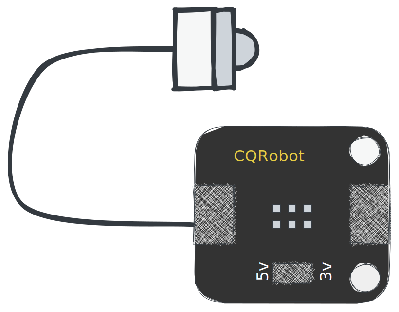

# レインバレル

> このプロジェクトは、スマートな水タンクに関するものです。水位を測定し、データをサーバーに送信します。サーバーを使用してウォーターポンプを制御できます。ポンプは、Web インターフェイスまたは電報ボットを介して制御できます。 HC-SR04超音波センサーを使用して水位を測定します。データは LoRaWAN ゲートウェイ経由で TTN に送信されます。

?> 元の文書は[英語](README.md).翻訳はGoogle翻訳で行いました。エラーが見つかった場合は、無視してください。ありがとう！

* * *

## 目次

1.  **クイックスタート**
    1.  序章
    2.  ハードウェア
    3.  フラッシュソフトウェア
2.  **ハードウェア**
    1.  センサー
    2.  電源
    3.  ハウジング
    4.  マイクロコントローラ
    5.  ゲートウェイ (オプション)
3.  **組み立て**
    1.  センサーからコントローラー
    2.  コントローラへの電源
    3.  トラブルシューティング
4.  **設定**
    1.  TTN
        1.  アカウントを作成する
        2.  アプリの作成
        3.  デコーダーの構成
        4.  資格証明のコピー
    2.  デバイス
        1.  ドライバをダウンロード
        2.  点滅
        3.  構成
5.  **デバッグ**
    1.  シリアルモニター
    2.  TTN コンソール
    3.  MQTT クライアント
    4.  落とし穴
6.  **データエンジニアリング**
    1.  ノードレッド
    2.  グラファーナ
    3.  アレクサスキル
    4.  アズール コネクト

* * *

## クイックスタート

### クイック スタート - はじめに

クイックスタートは、Arudino フレームワークを使用した IoT についての深い知識と、すぐに開始したい人向けに作成されています。それがどのように機能するかを理解したい場合は、[ドキュメンテーション](#hardware)。

### クイック スタート - ハードウェアの概要

次の部品が必要です。

-   LoRa チップを搭載したマイクロコントローラ
-   センサー
-   電源
-   ハウジング

?> パーツについて詳しく知りたい場合は、[ハードウェアのドキュメント](#Hardware)。

### クイックスタート - Flash ソフトウェア

1.  ボードをコンピュータに接続し、
2.  次のボタンをクリックします。

<esp-web-install-button manifest="/static/firmware_build/manifest.json"></esp-web-install-button>

?> 点滅プロセスについて詳しく知りたい場合は、[セットアップ ドキュメント](#Setup)。

## ハードウェア

1.  [センサー](#Sensors)
2.  [電源](#Power-supply)
3.  [ハウジング](#Housing)
4.  [マイクロコントローラ](#Microcontroller)
5.  [ゲートウェイ](#Gateway)

### センサー

水位を測るにはセンサーが必要です。防水で水槽内で使用できるセンサーを見つけるのは簡単なことではありません。次のセンサーがサポートされており、推奨されています。

#### 初心者

初心者の方は、安価なセンサーを使用して最初のプロトタイプを作成することをお勧めします。次のセンサーがサポートされており、推奨されています。

| 部                                                   | 説明                                                                                                                                                                                                                                                                                                                                                                                             |
| --------------------------------------------------- | ---------------------------------------------------------------------------------------------------------------------------------------------------------------------------------------------------------------------------------------------------------------------------------------------------------------------------------------------------------------------------------------------- |
|  | [HC-SR04 超音波センサー](https://amzn.to/3MHNrbJ)センサーは比較的安価で使いやすいです。防水ではありません。防水ケースに入れる必要があります。試してみたいだけなら、このセンサーをお勧めします。長期間の使用はお勧めできません。の**HC-SR04**センサーは、距離測定に使用される超音波センサーです。高周波の音波を発し、物体に衝突してから波が跳ね返るまでの時間を検出します。この時間は、センサーとオブジェクト間の距離を計算するために使用されます。通信範囲は最大 4 メートルで、Arduino、Raspberry Pi などのマイクロコントローラと接続できます。HC-SR04 は、ロボティクス、自動化、セキュリティ システム、および正確で信頼性の高い距離センシングを必要とするその他のアプリケーションで一般的に使用されています。 |
|              | [BL6180X](https://amzn.to/3zVEFPM)飛行時間センサーは比較的安価で使いやすいです。 VL6180X レーザー距離モジュールは、レーザーを使用してセンサーと物体の間の距離を測定するセンサーです。これは飛行時間型 (ToF) センサーです。つまり、レーザー光が物体に反射してセンサーに戻るまでの時間を測定します。センサーは防水ではありませんが、より高い精度を備えています。防水ケースに入れる必要があります。試してみたいだけなら、このセンサーをお勧めします。長期間の使用はお勧めできません。                                                                                                                             |

#### 高度

そのプロジェクトを長期間使用する場合は、より高価なセンサーを使用することをお勧めします。次のセンサーがサポートされており、推奨されています。

| 部                                                                      | 説明                                                                                                                                                                                                                                                                                                                                                                                                                                                                                                                                   |
| ---------------------------------------------------------------------- | ------------------------------------------------------------------------------------------------------------------------------------------------------------------------------------------------------------------------------------------------------------------------------------------------------------------------------------------------------------------------------------------------------------------------------------------------------------------------------------------------------------------------------------ |
|                    | [接触式水位センサー](https://amzn.to/41sKAaL)このセンサーは光学原理を利用して液面を検出するもので、光電式水面センサーとして知られています。このタイプのセンサーの主な利点の 1 つは、その優れた感度と機械部品がないことです。これにより、キャリブレーションの頻度が少なくなります。センサープローブ自体が小さく、設置方向が柔軟で、溶液のこぼれ、乾燥、水平レベルなどのさまざまな状態を検出できます。さらに、このセンサーはリマインダーおよびアラーム システムとして機能します。発光ダイオードとフォトトランジスタを内蔵しており、帯電部は制御液から完全に分離されており、安全性が確保されています。                                                                                                                                                                                                                    |
|  | [防水超音波センサー](https://amzn.to/3MNk4F2)JSN-SR04Tは、ソナー技術を利用して物体の距離を検出する超音波センサーモジュールです。このコンパクトで使いやすいモジュールは、高い精度と信頼性を備えているため、ロボット工学、自動化、セキュリティ システムなどの幅広いアプリケーションに最適です。センサーの検出範囲は最大 5 メートルで、角度 15 度以内の物体を検出できます。 40 kHz の周波数で動作し、解像度は 1 cm です。このモジュールには温度補償機能も組み込まれているため、さまざまな温度条件でも安定した正確な読み取りが保証されます。**JSN-SR04T**モジュールは、防水および防塵ケーシングで設計されており、過酷な環境での使用に適しています。簡単にインストールでき、シンプルな 3 ピン インターフェイスを介して、Arduino や Raspberry Pi などのさまざまなマイクロコントローラとシームレスに統合できます。全体として、JSN-SR04T 超音波センサー モジュールは、プロジェクトで信頼性が高く正確な距離測定ソリューションを探している人にとって優れた選択肢です。 |

### 電源

マイクロコントローラに電力を供給するには、電源が必要です。 18650 バッテリーが最適です。安いし、ソーラーパネルで充電できます。ただし、モバイルバッテリーまたは USB 電源を使用することもできます。

| 部                                                       | 説明                                                                                                                                                                                                                                                                                                                                                                                                                                               |
| ------------------------------------------------------- | ------------------------------------------------------------------------------------------------------------------------------------------------------------------------------------------------------------------------------------------------------------------------------------------------------------------------------------------------------------------------------------------------------------------------------------------------ |
|     | 電池にはたくさんの種類があります。最も一般的なのは、リチウム イオン、リチウム ポリマー、リン酸鉄リチウムです。の**18650 バッテリー**リチウムイオン電池です。これは、このプロジェクトに最適なオプションです。安いし、ソーラーパネルで充電できます。リチウムイオンでできており、最大500回充電できます。 18650バッテリーの電圧は3.7Vで、容量は約2200mAhです。ソーラーパネルの電圧は5V、電力は2Wです。ソーラーパネルは3時間でバッテリーを充電できます。当社のセンサーには 5V と 100mA が必要です。マイクロコントローラには 5V と 100mA が必要です。したがって、5Vを得るには電圧レギュレーターと18650バッテリーが2つ必要です。バッテリーは防水ではありません。防水ケースに入れる必要があります。また、高温にも注意してください。熱すぎるとバッテリーが爆発する可能性があります。長く使いたい方はこちらのバッテリーがおすすめです。 |
|  | **ソーラーパネル：**庭にあるので、ソーラーパネルを使用できます。防水仕様で雨天でも使用可能です。多結晶シリコンでできており、2Wの電力を持っています。ソーラー パネルを購入する場合は、少なくとも 400mA の 5V 出力があることを確認する必要があります。バッテリーを充電するには、充電コントローラーが必要です。幸いなことに、マイクロコントローラーには充電コントローラーが組み込まれているため、ソーラーパネルを直接使用できます。                                                                                                                                                                                                                        |

### ハウジング

センサーとマイクロコントローラーを保護するには、ハウジングが必要です。ハウジングは防水性があり、高温や紫外線に少し耐性がある必要があります。
使用**PETG**プロトタイプに適しています。防水ではなく、紫外線によって破壊される可能性があります。使用**PETG**長期使用に。防水性と耐紫外線性があります。使用することもできます**ABS**.防水性と耐紫外線性があります。

平**タッパーウェア**良いオプションです。防水性と耐紫外線性があります。

### マイクロコントローラ

マイクロコントローラはシステムの頭脳です。水位を測定し、データをサーバーに送信します。次のマイクロコントローラがサポートされ、推奨されています。

| 部                                                                   | 説明                                                                                                                                                                                                                                                                                                                                                                                                                                                                                                                                                                                                                                                                                                                                                             |
| ------------------------------------------------------------------- | -------------------------------------------------------------------------------------------------------------------------------------------------------------------------------------------------------------------------------------------------------------------------------------------------------------------------------------------------------------------------------------------------------------------------------------------------------------------------------------------------------------------------------------------------------------------------------------------------------------------------------------------------------------------------------------------------------------------------------------------------------------- |
|  | の[Seamuing SX1262 LoRa モジュール 868](https://amzn.to/3UFRGq5)LoRa モジュールを搭載したマイクロコントローラです。安価で使いやすいです。SX1262 は、さまざまなワイヤレス通信アプリケーションで使用するために設計された、高度に統合された低電力、長距離トランシーバーです。超低消費電力モードを備えているため、長いバッテリ寿命を必要とするバッテリ駆動のアプリケーションに最適です。 SX1262 は、最小限の電力消費で長距離通信を可能にする LoRa 変調技術を利用しています。見通し内で最大 15 km、都市環境で最大 2 km の範囲を持つ SX1262 は、長距離ワイヤレス通信アプリケーションに最適です。このトランシーバーは 860 ～ 930 MHz の周波数範囲で動作し、さまざまな地域の規制要件に対応しています。また、-148 dBm の高感度を備えているため、ノイズの多い環境や信号が弱い環境でも信頼性の高い通信が可能です。 SX1262 は高度に設定可能なインターフェイスを備えて設計されているため、幅広いアプリケーションに簡単に統合できます。また、トランシーバーが使用されていないときの消費電力を削減する低電力スタンバイ モードも備えています。全体として、SX1262 は汎用性と信頼性に優れたトランシーバ ソリューションであり、IoT、スマート メータリング、産業オートメーションなどの幅広いワイヤレス通信アプリケーションに最適です。**防水ではありません。**防水ケースに入れる必要があります。試してみたいだけなら、このマイクロコントローラをお勧めします。長期間の使用はお勧めできません。 |

### ゲートウェイ

TTNマップをチェックして、近くにゲートウェイがあるかどうかを確認してください.近くにゲートウェイがない場合は、ゲートウェイを購入できますが、インターネット接続が必要です。ゲートウェイは、マイクロコントローラーと TTN サーバー間のブリッジです。次のゲートウェイがサポートされており、推奨されています。

| 部                                                    | 説明                                                                                                                                                                                                                                                                                                                                                                                                                |
| ---------------------------------------------------- | ----------------------------------------------------------------------------------------------------------------------------------------------------------------------------------------------------------------------------------------------------------------------------------------------------------------------------------------------------------------------------------------------------------------- |
|  | [TTN 屋内ゲートウェイ](https://amzn.to/3L1x1JN)ゲートウェイは、安全なデバイス アクティベーション、グローバル カバレッジ、簡単なデバイス管理などのさまざまな機能を提供する The Things Network v3 とシームレスに連携するように設計されています。また、Bluetooth Low Energy (BLE) と Wi-Fi の組み込みサポートも備えており、スマートフォンやコンピューターを使用して簡単に構成および管理できます。全体として、Things Indoor LoRaWAN Indoor Gateway TTNv3は、LoRaWANネットワーク用の信頼性が高く使いやすいゲートウェイを探している人にとって優れた選択肢です.手頃な価格でエネルギー効率が高く、商用および産業用 IoT アプリケーションの両方にとって理想的な選択肢となる機能が満載です。 |

## 3. 組み立て

1.  [センサーからコントローラー](#sensor-to-controller)
2.  [コントローラへの電源](#power-to-controller)
3.  [トラブルシューティング](#trouble-shooting)

### センサーからコントローラー

この例では、HC-SR04 センサーをマイクロコントローラーに組み立てる方法を示します。センサーは、4 ピン ケーブルでマイクロコントローラーに接続されます。黄色のケーブルはトリガーケーブルです。青いケーブルはエコーケーブルです。赤いケーブルは 5V ケーブルです。黒いケーブルはアースケーブルです。

### コントローラへの電源

### トラブルシューティング

* * *

#### ロラワン

-   LoRaWAN ゲートウェイ

#### マイクロコントローラ

ソフトウェアを実行するにはボードが必要であることは明らかです。ただし、データを TTN に送信するには LoRa チップも必要です。次のボードがサポートされています。

-   [放牧に向かう](Hardware/TTGOLoRa32.md)
-   [ヘルテック LoRa32](Hardware/HeltecLoRa32.md)

### 回路図

### 3Dプリント部品

## ソフトウェア

### アルドゥイーノ

-   [アルドゥイーノ](Software/Arduino/README.md)

### サーバ

-   [サーバ](Software/Server/README.md)

### 電報ボット

-   [電報ボット](Software/TelegramBot/README.md)

## ライセンス

[表示-非営利-継承 4.0 国際 (CC BY-NC-SA 4.0)](https://creativecommons.org/licenses/by-nc-sa/4.0/)

**あなたは自由にできます：**

-   共有 — 任意の媒体または形式で資料をコピーおよび再配布します
-   適応 — 素材をリミックス、変換、構築する

* * *

_❤️で作られました[文書化する](https://docsify.js.org/)_
