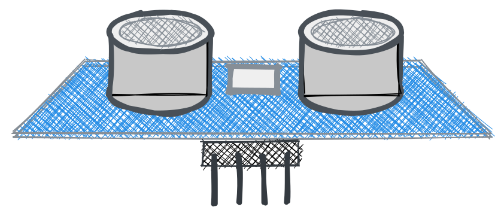
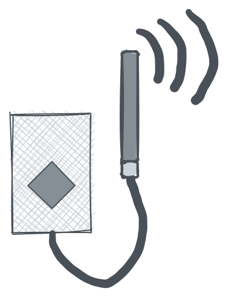

# regenfass

> This project is about a smart water tank. It measures the water level and sends the data to a server. The server can be used to control the water pump. The pump can be controlled via a web interface or via a telegram bot. It uses a  HC-SR04 ultrasonic sensor to measure the water level. The data is sent to TTN via a LoRaWAN gateway.

?> The original document was written in  [ English](README.md). The translation was made with Google Translate. If you find any errors, please try to ignore them. Thank you!

---

## Table Of Content

1. **Quickstart**
   1. Introduction
   2. Hardware
   3. Flash software
2. **Hardware**
   1. Sensors
   2. Power supply
   3. Housing
   4. Microcontroller
   5. Antenna
3. **Assembeling**
   1. Sensor to controller
   2. Power to controller
   3. Trouble shooting
4. **Setup**
   1. TTN
      1. Create Account
      2. Create App
      3. Configure Devoder
      4. Copy Credentials
   2. Device
      1. Download driver
      2. Flashing
      3. Configuration
5. **Debugging**
   1. Serial Monitor
   2. TTN Console
   3. MQTT Client
   4. Pit falls
6. **Data Engineering**
   1. Node RED
   2. Grafana
   3. Alexa Skill
   4. Azure Connect

---

## Quick start

### Quick start - Introduction

The quickstart is made for people who want to start right away and deep knowledge about IoT with the Arudino Framework. If you want to understand how it works, you can read the [ documentation](#hardware).

### Quick start - Hardware overview

You need the following parts:

* Microcontroller with LoRa chip
* Sensor
* Power supply
* Housing

?> If you want to know more about the parts, you can read the [ hardware documentation](#Hardware).

### Quick start - Flash software

1. Connect your board to your computer and
2. Click on the following button:

<esp-web-install-button manifest="/static/firmware_build/manifest.json"></esp-web-install-button>

?> If you want to know more about the flashing process, you can read the [ setup documentation](#Setup).

## Hardware

   1. [Sensors](#Sensors)
   2. [Power supply](#Power-supply)
   3. [Housing](#Housing)
   4. [Microcontroller](#Microcontroller)
   5. [Antenna](#Antenna)

### Sensors

To messure the water level you need a sensor.  It is not an easy task to find a sensor that is waterproof and can be used in a water tank. The following sensors are supported and recommended:

| Part | Description |
| --- | --- |
|  | [HC-SR04 Ultrasonic Sensor](https://www.amazon.de/gp/product/B07B4J8QZK/ref=ppx_yo_dt_b_asin_title_o00_s00?ie=UTF8&psc=1) The sensor is relativly cheap and easy to use. It is not waterproof. You have to put it in a waterproof housing. We recoment this sensor if you just want to try it out. It is not recommended for long term use. |  
|  | [Lasersensor](https://www.amazon.de/gp/product/B07B4J8QZK/ref=ppx_yo_dt_b_asin_title_o00_s00?ie=UTF8&psc=1) The sensor is relativly cheap and easy to use. As like the HC-SRo4 it is not waterproof but has a higher acuracy. You have to put it in a waterproof housing. We recoment this sensor if you just want to try it out. It is not recommended for long term use. |

| Part | Description |
| --- | --- |
|  | [HC-SR04 Ultrasonic Sensor](https://www.amazon.de/gp/product/B07B4J8QZK/ref=ppx_yo_dt_b_asin_title_o00_s00?ie=UTF8&psc=1) The sensor is relativly cheap and easy to use. It is not waterproof. You have to put it in a waterproof housing. We recoment this sensor if you just want to try it out. It is not recommended for long term use. |  
|  | [VL6180X](https://amzn.to/3zVEFPM) The time of flight sensor is relativly cheap and easy to use. As like the HC-SRo4 it is not waterproof but has a higher acuracy. You have to put it in a waterproof housing. We recoment this sensor if you just want to try it out. It is not recommended for long term use. |

#### Beginner

The HC-SR04 sensor is an ultrasonic sensor used for distance measurement. It emits high frequency sound waves and detects the time it takes for the waves to bounce back after hitting an object. This time is then used to calculate the distance between the sensor and the object. It has a range of up to 4 meters and can be interfaced with microcontrollers like Arduino, Raspberry Pi, etc. The HC-SR04 is commonly used in robotics, automation, security systems, and other applications that require accurate and reliable distance sensing. 

The HC-SR04 sensor is an ultrasonic distance sensing device. It is composed of two parts, the emitter and the receiver. The emitter emits an ultrasonic sound wave at 40kHz which travels through the air and if it encounters an object, it is reflected back to the receiver. The sensor then measures the time taken for the sound wave to return and using this value, computes the distance to the object. It can measure distances from 2 cm to 400 cm with accuracy up to 3 mm. 

* [HC-SR04 Ultrasonic Sensor](https://www.amazon.de/gp/product/B07B4J8QZK/ref=ppx_yo_dt_b_asin_title_o00_s00?ie=UTF8&psc=1)
* [Lasersensor](https://www.amazon.de/gp/product/B07B4J8QZK/ref=ppx_yo_dt_b_asin_title_o00_s00?ie=UTF8&psc=1)

#### Advanced

* [Water Sensor](https://www.amazon.de/gp/product/B07B4J8QZK/ref=ppx_yo_dt_b_asin_title_o00_s00?ie=UTF8&psc=1)
* [Water proof Ultrasonic Sensor](https://www.amazon.de/gp/product/B07B4J8QZK/ref=ppx_yo_dt_b_asin_title_o00_s00?ie=UTF8&psc=1)

### Power supply

To power the microcontroller you need a power supply. The 18650 battery is the best option. It is cheap and you can charge it with a solar panel. But you can also use a power bank or a USB power supply.

| Part | Description |
| --- | --- |
|   |There are many types of batteries. The most common are Lithium Ion, Lithium Polymer and Lithium Iron Phosphate. The **18650 battery** is a Lithium Ion battery. It is the best option for this project. It is cheap and you can charge it with a solar panel. It is made of Lithium Ion and can be charged up to 500 times. 18650 battery has a voltage of 3.7V and can have a capacity of araound 2200mAh. The solar panel has a voltage of 5V and a power of 2W. The solar panel can charge the battery in 3 hours. Our sensor needs 5V and 100mA. The microcontroller needs 5V and 100mA. So we need two 18650 batteries an a voltage regulator to get 5V. The battery is not waterproof. You have to put it in a waterproof housing. Also take care about high temperatures. The battery can explode if it is too hot. We recommend this battery if you want to use it for a long time. |
|   | **Solar panel:** Since ware are in our garden, we can use a solar panel. It is waterproof and can be used in the rain. It is made of polycrystalline silicon and has a power of 2W. If you buy a solar panel, you have to make shure that it has a 5V output with at least 400mA. To charge our batteries, we need a charge controller. Luckely the Microcontroller has a charge controller build in. So we can use the solar panel directly.  |

### Housing

To protect the sensor and the microcontroller you need a housings. The housing has to be waterproof and a little bit resistant to high temperatures and UV radiation.
Use PLA just for prototypes. It is not waterproof and can be destroyed by UV radiation. Use ABS for long term use. It is waterproof and UV resistant. You can also use PETG. It is waterproof and UV resistant. But it is not as strong as ABS.

Even tupperware is a good option. It is waterproof and UV resistant.

### Microcontroller

The microcontroller is the brain of the system. It is responsible for measuring the water level and sending the data to the server. The following microcontrollers are supported and recommended:

| Part | Description |
| --- | --- |
|   | **TTGO LoRa32:** The TTGO LoRa32 is a microcontroller with a LoRa module. It is cheap and easy to use. It is not waterproof. You have to put it in a waterproof housing. We recoment this microcontroller if you just want to try it out. It is not recommended for long term use. |

---

| Part | Description |
| --- | --- |
|   | [HC-SR04 Ultrasonic Sensor](https://www.amazon.de/gp/product/B07B4J8QZK/ref=ppx_yo_dt_b_asin_title_o00_s00?ie=UTF8&psc=1) |
|   | [TTGO LoRa32](https://www.amazon.de/gp/product/B07B4J8QZK/ref=ppx_yo_dt_b_asin_title_o00_s00?ie=UTF8&psc=1) |
|   | 18650 battery |
|   | Solar panel |

The following parts are recomnondations. You can use other parts if you want. But you may have to change the code. The following parts are recommended:

#### LoRaWAN

* LoRaWAN Gateway
#### Micro controller

It is ovious that you need a board to run the software. But you also need a LoRa chip to send the data to TTN. The following boards are supported:

* [TTGO LoRa32](Hardware/TTGOLoRa32.md)
* [Heltec LoRa32](Hardware/HeltecLoRa32.md)

### Schematic

### 3D-Printed Parts

## Software

### Arduino

* [Arduino](Software/Arduino/README.md)

### Server

* [Server](Software/Server/README.md)

### Telegram Bot

* [Telegram Bot](Software/TelegramBot/README.md)

## License

[Attribution-NonCommercial-ShareAlike 4.0 International (CC BY-NC-SA 4.0)](https://creativecommons.org/licenses/by-nc-sa/4.0/)

**You are free to:**

* Share — copy and redistribute the material in any medium or format
* Adapt — remix, transform, and build upon the material

---

*Made with ❤️ by [docsify](https://docsify.js.org/)*
