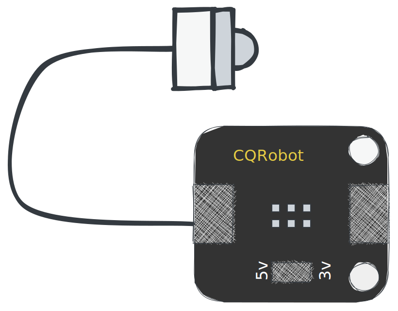
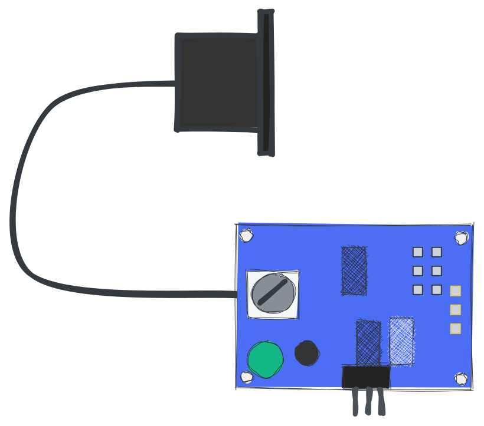
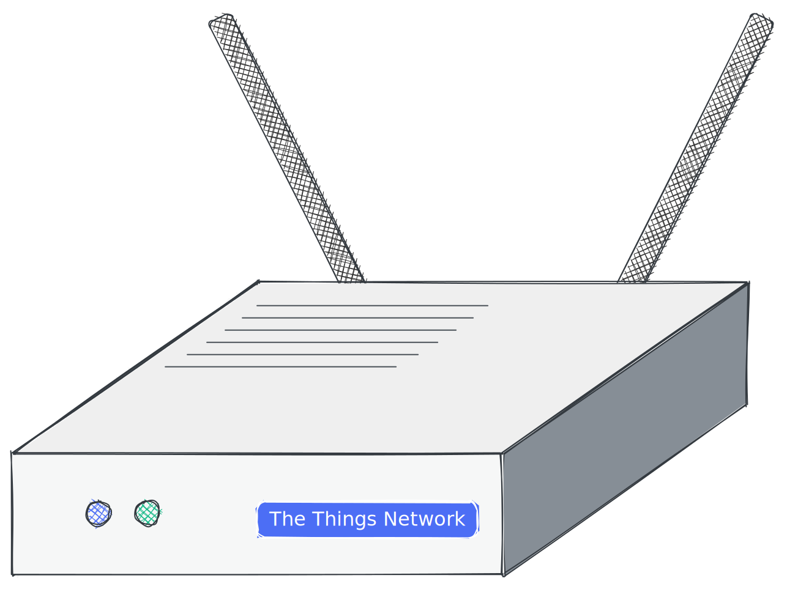

# дощова бочка

> Цей проект про розумний резервуар для води. Він вимірює рівень води та надсилає дані на сервер. Сервер можна використовувати для управління водяним насосом. Керувати насосом можна через веб-інтерфейс або через телеграм-бот. Для вимірювання рівня води використовується ультразвуковий датчик HC-SR04. Дані надсилаються до TTN через шлюз LoRaWAN.

?> Оригінальний документ було написано в[англійська](README.md). Переклад виконано за допомогою Google Translate. Якщо ви знайшли якісь помилки, спробуйте їх проігнорувати. Дякую тобі!

* * *

## Зміст

1.  **Швидкий початок**
    1.  вступ
    2.  Обладнання
    3.  Програмне забезпечення Flash
2.  **Обладнання**
    1.  Датчики
    2.  Блок живлення
    3.  житло
    4.  мікроконтролер
    5.  Шлюз (необов'язково)
3.  **Збірка**
    1.  Від датчика до контролера
    2.  Живлення до контролера
    3.  Вирішення проблем
4.  **Налаштування**
    1.  ТТН
        1.  Створити акаунт
        2.  Створити додаток
        3.  Налаштувати декодер
        4.  Копіювати облікові дані
    2.  пристрій
        1.  Завантажити драйвер
        2.  Блимає
        3.  Конфігурація
5.  **Налагодження**
    1.  Послідовний монітор
    2.  Консоль ТТН
    3.  Клієнт MQTT
    4.  Підводні камені
6.  **Інженерія даних**
    1.  Вузол RED
    2.  Графана
    3.  Alexa Skill
    4.  Azure Connect

* * *

## Швидкий початок

### Quick start - Introduction

Швидкий старт створений для людей, які хочуть почати відразу та отримати глибокі знання про IoT із Arudino Framework. Якщо ви хочете зрозуміти, як це працює, ви можете прочитати[документація](#hardware).

### Швидкий старт - Огляд обладнання

Вам потрібні наступні частини:

-   Мікроконтролер з мікросхемою LoRa
-   датчик
-   Блок живлення
-   житло

?> Якщо ви хочете дізнатися більше про частини, ви можете прочитати[апаратна документація](#Hardware).

### Швидкий старт - програмне забезпечення Flash

1.  Підключіть дошку до комп’ютера та
2.  Натисніть на наступну кнопку:

<esp-web-install-button manifest="/static/firmware_build/manifest.json"></esp-web-install-button>

?> Якщо ви хочете дізнатися більше про процес перепрошивки, ви можете прочитати[документація з налаштування](#Setup).

## Обладнання

1.  [Датчики](#Sensors)
2.  [Блок живлення](#Power-supply)
3.  [житло](#Housing)
4.  [мікроконтролер](#Microcontroller)
5.  [Шлюз](#Gateway)

### Датчики

Для вимірювання рівня води потрібен датчик. Це непросте завдання знайти водонепроникний датчик, який можна використовувати в резервуарі для води. Підтримуються та рекомендуються такі датчики:

#### Початківець

Якщо ви новачок, ми рекомендуємо використовувати дешеві датчики для створення вашого першого прототипу. Підтримуються та рекомендуються такі датчики:

| частина                                             | опис                                                                                                                                                                                                                                                                                                                                                                                                                                                                                                                                                                                                                                                                                                                                                                                                                                                                                              |
| --------------------------------------------------- | ------------------------------------------------------------------------------------------------------------------------------------------------------------------------------------------------------------------------------------------------------------------------------------------------------------------------------------------------------------------------------------------------------------------------------------------------------------------------------------------------------------------------------------------------------------------------------------------------------------------------------------------------------------------------------------------------------------------------------------------------------------------------------------------------------------------------------------------------------------------------------------------------- |
|  | [Ультразвуковий датчик HC-SR04](https://amzn.to/3MHNrbJ)Датчик порівняно дешевий і простий у використанні. Він не є водонепроникним. Ви повинні помістити його у водонепроникний корпус. Ми рекомендуємо цей датчик, якщо ви просто хочете його випробувати. Не рекомендується для тривалого використання. The**HC-SR04**датчик — це ультразвуковий датчик, який використовується для вимірювання відстані. Він випромінює високочастотні звукові хвилі та визначає час, який потрібен хвилям, щоб відскочити після удару об об’єкт. Потім цей час використовується для обчислення відстані між датчиком і об’єктом. Він має радіус дії до 4 метрів і може підключатися до таких мікроконтролерів, як Arduino, Raspberry Pi тощо. HC-SR04 зазвичай використовується в робототехніці, автоматизації, системах безпеки та інших програмах, які вимагають точного та надійного вимірювання відстані. |
|              | [BL6180X](https://amzn.to/3zVEFPM)Датчик часу польоту відносно дешевий і простий у використанні. Лазерний модуль відстані VL6180X — це датчик, який використовує лазер для вимірювання відстані між датчиком і об’єктом. Це датчик часу прольоту (ToF), що означає, що він вимірює час, який потрібен лазерному світлу, щоб відбити об’єкт і повернутися до датчика. Датчик не є водонепроникним, але має вищу точність. Ви повинні помістити його у водонепроникний корпус. Ми рекомендуємо цей датчик, якщо ви просто хочете його випробувати. Не рекомендується для тривалого використання.                                                                                                                                                                                                                                                                                                    |

#### Просунутий

Якщо ви хочете використовувати цей проект протягом тривалого часу, рекомендуємо використовувати більш дорогі датчики. Підтримуються та рекомендуються такі датчики:

| частина                                                                | опис                                                                                                                                                                                                                                                                                                                                                                                                                                                                                                                                                                                                                                                                                                                                                                                                                                                                                                                                                                                                                                                                                                                                                                                         |
| ---------------------------------------------------------------------- | -------------------------------------------------------------------------------------------------------------------------------------------------------------------------------------------------------------------------------------------------------------------------------------------------------------------------------------------------------------------------------------------------------------------------------------------------------------------------------------------------------------------------------------------------------------------------------------------------------------------------------------------------------------------------------------------------------------------------------------------------------------------------------------------------------------------------------------------------------------------------------------------------------------------------------------------------------------------------------------------------------------------------------------------------------------------------------------------------------------------------------------------------------------------------------------------- |
|                    | [Контактний датчик рівня води](https://amzn.to/41sKAaL)Цей датчик використовує оптичні принципи для визначення рівня рідини та відомий як фотоелектричний датчик рівня рідини у воді. Однією з основних переваг цього типу датчика є його чудова чутливість і відсутність механічних частин, що призводить до менш частого калібрування. Сам зонд датчика невеликий і гнучкий з точки зору орієнтації розміщення, що дозволяє йому виявляти різні умови, такі як розлив розчину, сухість і горизонтальний рівень. Крім того, цей датчик може виконувати функцію нагадування та сигналізації. Пристрій має вбудований випромінюючий діод і фототранзистор, при цьому заряджена частина повністю ізольована від контрольованої рідини, що забезпечує безпеку.                                                                                                                                                                                                                                                                                                                                                                                                                                  |
|  | [Водонепроникний ультразвуковий датчик](https://amzn.to/3MNk4F2)JSN-SR04T — це модуль ультразвукового датчика, який використовує технологію гідролокатора для визначення відстані до об’єктів. Цей компактний і простий у використанні модуль відрізняється високою точністю та надійністю, що робить його ідеальним вибором для широкого спектру застосувань, включаючи робототехніку, автоматизацію та системи безпеки. Датчик має діапазон виявлення до 5 метрів і може виявляти об'єкти під кутом 15 градусів. Він працює на частоті 40 кГц і має роздільну здатність 1 см. Модуль також містить вбудовану функцію температурної компенсації, що забезпечує стабільні та точні показання навіть за змінних температурних умов.**JSN-SR04T**Модуль має водонепроникний і пилонепроникний корпус, що робить його придатним для використання в суворих умовах. Він простий в установці та бездоганно інтегрується з широким спектром мікроконтролерів, таких як Arduino та Raspberry Pi, через простий триконтактний інтерфейс. Загалом модуль ультразвукового датчика JSN-SR04T є чудовим вибором для тих, хто шукає надійне та точне рішення для вимірювання відстані для своїх проектів. |

### Блок живлення

Для живлення мікроконтролера необхідний блок живлення. Акумулятор 18650 - оптимальний варіант. Це дешево, і ви можете заряджати його за допомогою сонячної панелі. Але ви також можете використовувати павербанк або USB-блок живлення.

| частина                                                 | опис                                                                                                                                                                                                                                                                                                                                                                                                                                                                                                                                                                                                                                                                                                                                                                                                                                                                                                                                                                |
| ------------------------------------------------------- | ------------------------------------------------------------------------------------------------------------------------------------------------------------------------------------------------------------------------------------------------------------------------------------------------------------------------------------------------------------------------------------------------------------------------------------------------------------------------------------------------------------------------------------------------------------------------------------------------------------------------------------------------------------------------------------------------------------------------------------------------------------------------------------------------------------------------------------------------------------------------------------------------------------------------------------------------------------------- |
|     | Існує багато типів акумуляторів. Найбільш поширеними є літій-іонний, літій-полімерний і літій-залізофосфатний. The**Батарея 18650**це літій-іонний акумулятор. Це найкращий варіант для цього проекту. Це дешево, і ви можете заряджати його за допомогою сонячної панелі. Він виготовлений з літій-іонів і може заряджатися до 500 разів. Акумулятор 18650 має напругу 3,7 В і може мати ємність близько 2200 мАг. Сонячна панель має напругу 5 В і потужність 2 Вт. Сонячна панель здатна зарядити акумулятор за 3 години. Наш датчик потребує 5 В і 100 мА. Для мікроконтролера потрібно 5 В і 100 мА. Отже, нам потрібні дві батареї 18650 і регулятор напруги, щоб отримати 5 В. Акумулятор не є водонепроникним. Ви повинні помістити його у водонепроникний корпус. Також подбайте про високі температури. Акумулятор може вибухнути, якщо він занадто гарячий. Ми рекомендуємо цей акумулятор, якщо ви хочете використовувати його протягом тривалого часу. |
|  | **Сонячна панель:**Оскільки ми в нашому саду, ми можемо використовувати сонячну панель. Він водонепроникний і може використовуватися під дощем. Він виготовлений з полікристалічного кремнію і має потужність 2 Вт. Якщо ви купуєте сонячну панель, ви повинні переконатися, що вона має вихідну напругу 5 В з принаймні 400 мА. Щоб заряджати наші акумулятори, нам потрібен контролер заряду. На щастя, мікроконтролер має вбудований контролер заряду. Тому ми можемо використовувати сонячну панель безпосередньо.                                                                                                                                                                                                                                                                                                                                                                                                                                              |

### житло

Щоб захистити датчик і мікроконтролер, потрібен корпус. Корпус повинен бути водонепроникним і трохи стійким до високих температур і ультрафіолетового випромінювання.
використання**PETG**підходить для прототипів. Він не є водонепроникним і може бути зруйнований УФ-випромінюванням. використання**PETG**для тривалого використання. Він водонепроникний і стійкий до ультрафіолету. Ви також можете використовувати**ABS**. Він водонепроникний і стійкий до ультрафіолету.

Навіть**туперний посуд**це хороший варіант. Він водонепроникний і стійкий до ультрафіолету.

### мікроконтролер

Мікроконтролер - це мозок системи. Він відповідає за вимірювання рівня води та відправку даних на сервер. Підтримуються та рекомендуються такі мікроконтролери:

| частина                                                             | опис                                                                                                                                                                                                                                                                                                                                                                                                                                                                                                                                                                                                                                                                                                                                                                                                                                                                                                                                                                                                                                                                                                                                                                                                                                                                                                                                                                                                                                                                                                                                                                                                                                                                                           |
| ------------------------------------------------------------------- | ---------------------------------------------------------------------------------------------------------------------------------------------------------------------------------------------------------------------------------------------------------------------------------------------------------------------------------------------------------------------------------------------------------------------------------------------------------------------------------------------------------------------------------------------------------------------------------------------------------------------------------------------------------------------------------------------------------------------------------------------------------------------------------------------------------------------------------------------------------------------------------------------------------------------------------------------------------------------------------------------------------------------------------------------------------------------------------------------------------------------------------------------------------------------------------------------------------------------------------------------------------------------------------------------------------------------------------------------------------------------------------------------------------------------------------------------------------------------------------------------------------------------------------------------------------------------------------------------------------------------------------------------------------------------------------------------- |
|  | The[Seamuing SX1262 LoRa Module 868](https://amzn.to/3UFRGq5)це мікроконтролер з модулем LoRa. Він дешевий і простий у використанні. SX1262 — це високоінтегрований малопотужний трансивер далекого радіусу дії, розроблений для використання в різноманітних програмах бездротового зв’язку. Він має режим наднизького енергоспоживання, що робить його ідеальним для додатків із живленням від батареї, які потребують тривалого часу автономної роботи. SX1262 використовує техніку модуляції LoRa, яка забезпечує зв'язок на великі відстані з мінімальним енергоспоживанням. Завдяки радіусу дії до 15 км в умовах прямої видимості та до 2 км у міських умовах SX1262 є чудовим вибором для додатків бездротового зв’язку на великій відстані. Трансивер працює в діапазоні частот 860-930 МГц, що робить його сумісним з широким спектром регіональних нормативних вимог. Він також має високу чутливість -148 дБм, що забезпечує надійний зв'язок навіть у шумному або слабкому середовищі. SX1262 має інтерфейс із широкими можливостями конфігурації, що дозволяє легко інтегрувати його в широкий спектр програм. Він також має режим очікування з низьким енергоспоживанням, який зменшує споживання енергії, коли трансивер не використовується. Загалом, SX1262 — це універсальне та надійне рішення для трансивера, яке ідеально підходить для широкого спектру додатків бездротового зв’язку, включаючи IoT, інтелектуальне вимірювання та промислову автоматизацію.**Він не є водонепроникним.**Ви повинні помістити його у водонепроникний корпус. Ми рекомендуємо цей мікроконтролер, якщо ви просто хочете його випробувати. Не рекомендується для тривалого використання. |

### Шлюз

Перевірте карту TTN, щоб побачити, чи є шлюз поблизу вас. Якщо поблизу вас немає шлюзу, ви можете придбати шлюз, але вам потрібне підключення до Інтернету. Шлюз є мостом між мікроконтролером і сервером TTN. Підтримуються та рекомендуються такі шлюзи:

| частина                                              | опис                                                                                                                                                                                                                                                                                                                                                                                                                                                                                                                                                                                                                                                                                                |
| ---------------------------------------------------- | --------------------------------------------------------------------------------------------------------------------------------------------------------------------------------------------------------------------------------------------------------------------------------------------------------------------------------------------------------------------------------------------------------------------------------------------------------------------------------------------------------------------------------------------------------------------------------------------------------------------------------------------------------------------------------------------------- |
|  | [Внутрішній шлюз TTN](https://amzn.to/3L1x1JN)Шлюз розроблено для бездоганної роботи з The Things Network v3, яка пропонує ряд функцій, таких як безпечна активація пристрою, глобальне покриття та просте керування пристроєм. Він також має вбудовану підтримку Bluetooth Low Energy (BLE) і Wi-Fi, що дозволяє легко налаштовувати та керувати за допомогою смартфона або комп’ютера. Загалом, Things Indoor LoRaWAN Indoor Gateway TTNv3 є чудовим вибором для тих, хто шукає надійний, простий у використанні шлюз для своєї мережі LoRaWAN. Він доступний, енергоефективний і оснащений функціями, які роблять його ідеальним вибором як для комерційних, так і для промислових додатків IoT. |

## 3. Складання

1.  [Від датчика до контролера](#sensor-to-controller)
2.  [Живлення до контролера](#power-to-controller)
3.  [Вирішення проблем](#trouble-shooting)

### Від датчика до контролера

### Живлення до контролера

### Вирішення проблем

* * *

#### LoRaWAN

-   Шлюз LoRaWAN

#### Мікро контролер

Очевидно, що вам потрібна плата для запуску програмного забезпечення. Але вам також потрібен чіп LoRa, щоб надсилати дані на TTN. Підтримуються такі дошки:

-   [Заголовок на випас](Hardware/TTGOLoRa32.md)
-   [Heltec LoRa32](Hardware/HeltecLoRa32.md)

### Схематичний

### 3D-друковані частини

## програмне забезпечення

### Arduino

-   [Arduino](Software/Arduino/README.md)

### Сервер

-   [Сервер](Software/Server/README.md)

### Telegram бот

-   [Telegram бот](Software/TelegramBot/README.md)

## Ліцензія

[Attribution-NonCommercial-ShareAlike 4.0 International (CC BY-NC-SA 4.0)](https://creativecommons.org/licenses/by-nc-sa/4.0/)

**Ви можете:**

-   Поділіться — копіюйте та розповсюджуйте матеріал у будь-якому носії чи форматі
-   Адаптуйте — створюйте ремікси, трансформуйте та надбудовуйте матеріал

* * *

_Зроблено за допомогою ❤️[документувати](https://docsify.js.org/)_
