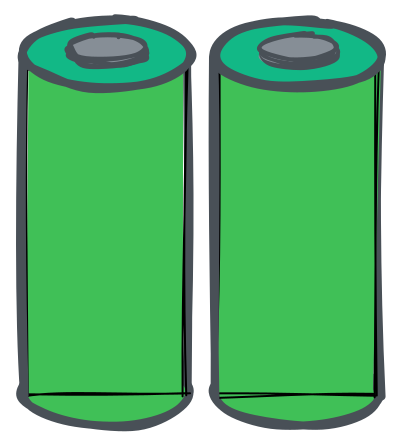

# дощова бочка

> Цей проект стосується смарт -резервуару з водою. Він вимірює рівень води та надсилає дані на сервер. Сервер може використовуватися для управління водяним насосом. Насос можна керувати через веб -інтерфейс або через Telegram Bot. Він використовує ультразвуковий датчик HC-SR04 для вимірювання рівня води. Дані надсилаються TTN через шлюз Лоравана.

?> Оригінальний документ був записаний[Англійська мова](README.md). Переклад був здійснений за допомогою Google Translate. Якщо ви знайдете якісь помилки, спробуйте їх ігнорувати. Дякую!

* * *

## Таблиця змісту

1.  **Швидкий старт**
    1.  Вступ
    2.  Обладнання
    3.  Програмне забезпечення Flash
2.  **Обладнання**
    1.  Датчики
    2.  Живлення
    3.  Корпус
    4.  Мікроконтролер
    5.  Шлюз (необов’язково)
3.  **Складання**
    1.  Датчик контролера
    2.  Потужність контролера
    3.  Проблема зйомки
4.  **Налаштування**
    1.  TTN
        1.  Створити рахунок
        2.  Створити додаток
        3.  Налаштування декодера
        4.  Копіювати облікові дані
    2.  Пристрій
        1.  Завантажити драйвер
        2.  Миготливий
        3.  Конфігурація
5.  **Налагодження**
    1.  Серійний монітор
    2.  Консоль TTN
    3.  Клієнт MQTT
    4.  Підводні камені
6.  **Інженерія даних**
    1.  Вузол червоний
    2.  Вичісувати
    3.  Майстерність Alexa
    4.  Azure Connect

* * *

## Швидкий старт

### Швидкий старт - Вступ

Швидкий старт створений для людей, які хочуть почати відразу і глибокі знання про IoT з рамками Arudino. Якщо ви хочете зрозуміти, як це працює, ви можете прочитати[документація](#hardware).

### Швидкий старт - Огляд обладнання

Вам потрібні такі частини:

-   Мікроконтролер з чіпом Lora
-   Датчик
-   Живлення
-   Корпус

?> Якщо ви хочете дізнатися більше про частини, ви можете прочитати[Апаратна документація](#Hardware).

### Швидкий запуск - Flash Software

1.  Підключіть дошку до комп’ютера та
2.  Натисніть на наступну кнопку:

<esp-web-install-button manifest="/static/firmware_build/manifest.json"></esp-web-install-button>

?> Якщо ви хочете дізнатися більше про миготливий процес, ви можете прочитати[Документація налаштування](#Setup).

## Обладнання

1.  [Датчики](#Sensors)
2.  [Живлення](#Power-supply)
3.  [Корпус](#Housing)
4.  [Мікроконтролер](#Microcontroller)
5.  [Ворота](#Gateway)

### Датчики

Для вимірювання рівня води потрібен датчик. Нелегке завдання знайти датчик, який є водонепроникним і може бути використаний у резервуарі для води. Наступні датчики підтримуються та рекомендуються:

#### Новачок

Якщо ви початківець, рекомендуємо використовувати дешеві датчики для створення першого прототипу. Наступні датчики підтримуються та рекомендуються:

| Розлучатися                                         | Опис                                                                                                                                                                                                                                                                                                                                                                                                                                                                                                                                                                                                                                                                                                                                                                                                                                                                                                            |
| --------------------------------------------------- | --------------------------------------------------------------------------------------------------------------------------------------------------------------------------------------------------------------------------------------------------------------------------------------------------------------------------------------------------------------------------------------------------------------------------------------------------------------------------------------------------------------------------------------------------------------------------------------------------------------------------------------------------------------------------------------------------------------------------------------------------------------------------------------------------------------------------------------------------------------------------------------------------------------- |
|  | [HC-SR04 Ультразвуковий датчик](https://amzn.to/3MHNrbJ)Датчик релятивно дешевий і простий у використанні. Це не водонепроникний. Ви повинні покласти його у водонепроникний корпус. Ми рекомендуємо цей датчик, якщо ви просто хочете спробувати його. Це не рекомендується для довгострокового використання. З**HC-SR04**Датчик - це ультразвуковий датчик, який використовується для вимірювання відстані. Він випромінює звукові хвилі високої частоти і виявляє час, необхідний для того, щоб хвилі відскочили назад після удару об'єкта. Потім цей час використовується для обчислення відстані між датчиком і об'єктом. Він має діапазон до 4 метрів і може бути взаємопов'язаний з мікроконтролами, такими як Arduino, Raspberry Pi тощо. HC-SR04 зазвичай використовується в робототехніці, автоматизації, системах безпеки та інших програм, які потребують точного та надійного зондування відстані. |
|              | [VL6180X](https://amzn.to/3zVEFPM)Час датчика польоту ретонно дешевий і простий у використанні. Модуль лазерної відстані VL6180X - це датчик, який використовує лазер для вимірювання відстані між датчиком і об'єктом. Це датчик часу польоту (TOF), що означає, що він вимірює час, необхідний для лазерного світла, щоб відскочити від об'єкта і повернутися до датчика. Датчик не є водонепроникним, але має більш високу акуратність. Ви повинні покласти його у водонепроникний корпус. Ми рекомендуємо цей датчик, якщо ви просто хочете спробувати його. Це не рекомендується для довгострокового використання.                                                                                                                                                                                                                                                                                         |

#### Просунутий

Якщо ви хочете використовувати цей проект довгий час, рекомендуємо використовувати більш дорогі датчики. Наступні датчики підтримуються та рекомендуються:

| Розлучатися                                                            | Опис                                                                                                                                                                                                                                                                                                                                                                                                                                                                                                                                                                                                                                                                                                                                                                                                                                                                                                                                                                                                                                                                                                                                                        |
| ---------------------------------------------------------------------- | ----------------------------------------------------------------------------------------------------------------------------------------------------------------------------------------------------------------------------------------------------------------------------------------------------------------------------------------------------------------------------------------------------------------------------------------------------------------------------------------------------------------------------------------------------------------------------------------------------------------------------------------------------------------------------------------------------------------------------------------------------------------------------------------------------------------------------------------------------------------------------------------------------------------------------------------------------------------------------------------------------------------------------------------------------------------------------------------------------------------------------------------------------------- |
|                    | [Зверніться до датчика рівня води](https://amzn.to/41sKAaL)Цей датчик використовує оптичні принципи для виявлення рівня рідини і відомий як датчик фотоелектричної води. Однією з головних переваг цього типу датчика є його відмінна чутливість та відсутність механічних деталей, що призводить до меншої калібрування. Сам датчик є невеликим і гнучким з точки зору орієнтації на розміщення, що дозволяє виявити різноманітні умови, такі як розлив розчину, сухість та горизонтальний рівень. Крім того, цей датчик може функціонувати як нагадування та сигналізація. Пристрій оснащений вбудованим випромінюючим діодом та фототранзістром, заряджена частина повністю ізольована від контрольованої рідини, забезпечуючи безпеку.                                                                                                                                                                                                                                                                                                                                                                                                                  |
|  | [Ультразвуковий датчик водонепроникування](https://amzn.to/3MNk4F2)JSN-SR04T-це ультразвуковий датчик, який використовує технологію SONAR для виявлення відстані об'єктів. Цей компактний та простий у використанні модуль має високу точність та надійність, що робить його ідеальним вибором для широкого спектру додатків, включаючи робототехніку, автоматизацію та системи безпеки. Датчик має діапазон виявлення до 5 метрів і може виявити об'єкти під кутом 15 градусів. Він працює з частотою 40 кГц і має роздільну здатність 1 см. Модуль також включає вбудовану функцію компенсації температури, забезпечуючи стабільні та точні показання навіть у різних температурних умовах.**JSN-SR04T**Модуль розроблений з водонепроникним та пилостійким кожухом, що робить його придатним для використання в суворих умовах. Це легко встановити та безперешкодно інтегрується з широким діапазоном мікроконтролерів, таких як Arduino та Raspberry Pi, через його простий трипіновий інтерфейс. Загалом, ультразвуковий датчик JSN-SR04T-це відмінний вибір для тих, хто шукає надійне та точне рішення для вимірювання відстані для своїх проектів. |

### Живлення

Для живлення мікроконтролера вам потрібен джерело живлення. Акумулятор 18650 - найкращий варіант. Це дешево, і ви можете зарядити його за допомогою сонячної панелі. Але ви також можете використовувати електроенергетичний банк або USB -джерело живлення.

| Розлучатися                                             | Опис                                                                                                                                                                                                                                                                                                                                                                                                                                                                                                                                                                                                                                                                                                                                                                                                                                                                                                                                                |
| ------------------------------------------------------- | --------------------------------------------------------------------------------------------------------------------------------------------------------------------------------------------------------------------------------------------------------------------------------------------------------------------------------------------------------------------------------------------------------------------------------------------------------------------------------------------------------------------------------------------------------------------------------------------------------------------------------------------------------------------------------------------------------------------------------------------------------------------------------------------------------------------------------------------------------------------------------------------------------------------------------------------------- |
|     | Існує багато типів батарей. Найпоширенішими є літій -іон, літієвий полімер та літієвий фосфат заліза. З**18650 акумулятор**- літій -іонний акумулятор. Це найкращий варіант для цього проекту. Це дешево, і ви можете зарядити його за допомогою сонячної панелі. Він виготовлений з літієвого іона і може заряджати до 500 разів. 18650 акумулятор має напругу 3,7 В і може мати місткість араунду 2200 мАг. Сонячна панель має напругу 5 В і потужність 2 Вт. Сонячна панель може заряджати акумулятор за 3 години. Наш датчик потребує 5 В і 100 мА. Мікроконтролер потребує 5 В та 100 мА. Тож нам потрібні два батареї 18650 р. Регулятор напруги, щоб отримати 5В. Акумулятор не є водонепроникним. Ви повинні покласти його у водонепроникний корпус. Також дбайте про високі температури. Акумулятор може вибухнути, якщо він занадто гарячий. Ми рекомендуємо цей акумулятор, якщо ви хочете використовувати його протягом тривалого часу. |
|  | **Сонячна панель:**Оскільки ми в своєму саду, ми можемо використовувати сонячну панель. Він є водонепроникним і може використовуватися під дощем. Він виготовлений з полікристалічного кремнію і має силу 2 Вт. Якщо ви купуєте сонячну панель, вам доведеться зробити Shure, що він має 5В -вихід щонайменше 400 мА. Щоб заряджати наші акумулятори, нам потрібен контролер заряду. На щастя, мікроконтролер має вбудову контролера заряду. Тому ми можемо використовувати сонячну панель безпосередньо.                                                                                                                                                                                                                                                                                                                                                                                                                                           |

### Корпус

Для захисту датчика та мікроконтролера вам потрібні корпуси. Корпус повинен бути водонепроникним і трохи стійким до високих температур та УФ -випромінювання.
Використання**Петг**добре для прототипів. Він не є водонепроникним і може бути знищений ультрафіолетовим випромінюванням. Використання**Петг**для довгострокового використання. Він є водонепроникним та стійким до УФ. Ви також можете використовувати**Абс**. Він є водонепроникним та стійким до УФ.

Навіть**Tupperware**це хороший варіант. Він є водонепроникним та стійким до УФ.

### Мікроконтролер

Мікроконтролер - це мозок системи. Він відповідає за вимірювання рівня води та надсилання даних на сервер. Наступні мікроконтролери підтримуються та рекомендуються:

| Розлучатися                                                         | Опис                                                                                                                                                                                                                                                                                                                                                                                                                                                                                                                                                                                                                                                                                                                                                                                                                                                                                                                                                                                                                                                                                                                                                                                                                                                                                                                                                                                                                                                                                                                                                                                                                                                                                   |
| ------------------------------------------------------------------- | -------------------------------------------------------------------------------------------------------------------------------------------------------------------------------------------------------------------------------------------------------------------------------------------------------------------------------------------------------------------------------------------------------------------------------------------------------------------------------------------------------------------------------------------------------------------------------------------------------------------------------------------------------------------------------------------------------------------------------------------------------------------------------------------------------------------------------------------------------------------------------------------------------------------------------------------------------------------------------------------------------------------------------------------------------------------------------------------------------------------------------------------------------------------------------------------------------------------------------------------------------------------------------------------------------------------------------------------------------------------------------------------------------------------------------------------------------------------------------------------------------------------------------------------------------------------------------------------------------------------------------------------------------------------------------------- |
|  | З[Seamuing SX1262 LORA MODULE 868](https://amzn.to/3UFRGq5)- мікроконтролер з модулем Lora. Він дешевий і простий у використанні. SX1262-це високо інтегрований трансивер з низькою потужністю, далекий трансивер, призначений для використання в різних програмах бездротового зв'язку. Він оснащений ультра-низьким режимом споживання електроенергії, що робить його ідеальним для додатків, що працюють на батареї, які потребують тривалого часу акумулятора. SX1262 використовує методику модуляції LORA, що дозволяє далекі комунікації з мінімальним споживанням електроенергії. Маючи діапазон до 15 км у умовах огляду на огляду та до 2 км у міських умовах, SX1262 є відмінним вибором для додатків бездротового зв'язку на далекі дальності. Приймач працює в діапазоні частот 860-930 МГц, що робить його сумісним з широким спектром регіональних регуляторних вимог. Він також має високу чутливість -148 дБм, що забезпечує надійне спілкування навіть у галасливих або слабких сигналах. SX1262 розроблений з високо налаштованим інтерфейсом, що дозволяє легко інтегруватися в широкий спектр програм. Він також має режим очікування малої потужності, що зменшує споживання електроенергії, коли приймач не використовується. Загалом, SX1262 - це дуже універсальне та надійне рішення для трансивера, яке ідеально підходить для широкого спектру додатків бездротового зв'язку, включаючи IoT, розумне вимірювання та промислову автоматизацію.**Це не водонепроникний.**Ви повинні покласти його у водонепроникний корпус. Ми рекомендуємо цей мікроконтролер, якщо ви просто хочете спробувати його. Це не рекомендується для довгострокового використання. |

### Ворота

Перевірте карту TTN, щоб побачити, чи є біля вас шлюз. Якщо біля вас немає шлюзу, ви можете придбати шлюз, але вам потрібно підключення до Інтернету. Шлюз - це міст між мікроконтролером та сервером TTN. Наступні шлюзи підтримуються та рекомендуються:

| Розлучатися                                          | Опис                                                                                                                                                                                                                                                                                                                                                                                                                                                                                                                                                                                                                                                                                                                                                       |
| ---------------------------------------------------- | ---------------------------------------------------------------------------------------------------------------------------------------------------------------------------------------------------------------------------------------------------------------------------------------------------------------------------------------------------------------------------------------------------------------------------------------------------------------------------------------------------------------------------------------------------------------------------------------------------------------------------------------------------------------------------------------------------------------------------------------------------------- |
|  | [TTN в приміщенні](https://amzn.to/3L1x1JN)Gateway призначений для безперешкодного співпраці з The Things Network V3, яка пропонує цілий ряд функцій, таких як активація безпечного пристрою, глобальне покриття та легке управління пристроями. Він також оснащений вбудованою підтримкою для Bluetooth з низькою енергією (BLE) та Wi-Fi, що дозволяє прості конфігурацію та управління за допомогою смартфона чи комп'ютера. Загалом, речі в приміщенні в приміщенні Lorawan в приміщенні TTNV3-це відмінний вибір для тих, хто шукає надійний, простий у користуванні шлюз для їх мережі Lorawan. Він доступний, енергоефективний та упакований з функціями, які роблять його ідеальним вибором як для комерційних, так і для промислових програм IoT. |

## 3. Збірка

1.  [Датчик контролера](#sensor-to-controller)
2.  [Потужність контролера](#power-to-controller)
3.  [Проблема зйомки](#trouble-shooting)

### Датчик контролера

Цей приклад ілюструє, як зібрати датчик HC-SR04 до мікроконтролера. Датчик підключений до мікроконтролера з 4 -контактним кабелем. Жовтий кабель - це тригерний кабель. Синій кабель - це ехо -кабель. Червоний кабель - це кабель 5В. Чорний кабель - це наземний кабель.

### Потужність контролера

### Проблема зйомки

* * *

#### Лораван

-   Lorawan Gateway

#### Мікро контролера

Очевидно, що вам потрібна дошка для запуску програмного забезпечення. Але вам також потрібен чіп Lora, щоб надіслати дані в TTN. Підтримуються такі дошки:

-   [TTGO LORA32](Hardware/TTGOLoRa32.md)
-   [Heltec Lora32](Hardware/HeltecLoRa32.md)

### Схематичний

### 3D-друковані частини

## Програмне забезпечення

### Ардуїно

-   [Ардуїно](Software/Arduino/README.md)

### Сервер

-   [Сервер](Software/Server/README.md)

### Телеграма бот

-   [Телеграма бот](Software/TelegramBot/README.md)

## Сприяти

-   <https://github.com/ttnleipzig/regenfass-hc-sr04/>
-

## Ліцензія

[Attribution-Noncommercial-Sharealike 4.0 International (CC BY-NC-SA 4.0)](https://creativecommons.org/licenses/by-nc-sa/4.0/)

**Ви вільні:**

-   Поділитися - копіювати та перерозподілити матеріал у будь -якому середовищі або форматі
-   Адаптувати - реміксу, перетворити та будувати на матеріалі

* * *

_Зроблено з ❤[документ](https://docsify.js.org/)_
