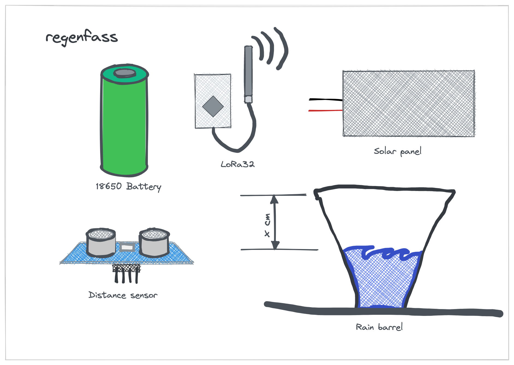

# 雨桶

> 这个项目是关于一个智能水箱的。它测量水位并将数据发送到服务器。服务器可用于控制水泵。该泵可以通过网络界面或电报机器人进行控制。它使用 HC-SR04 超声波传感器测量水位。数据通过 LoRaWAN 网关发送到 TTN。

?> 原始文件写于[英语](README.md).翻译是用谷歌翻译完成的。如果您发现任何错误，请尽量忽略它们。谢谢你！

* * *

## 表中的内容

1.  **快速开始**
    1.  介绍
    2.  硬件
    3.  闪存软件
2.  **硬件**
    1.  传感器
    2.  电源
    3.  住房
    4.  微控制器
    5.  天线
3.  **组装**
    1.  传感器到控制器
    2.  控制器电源
    3.  故障排除
4.  **设置**
    1.  TTN
        1.  创建账户
        2.  创建应用程序
        3.  配置解码器
        4.  复制凭据
    2.  设备
        1.  下载驱动程序
        2.  闪烁
        3.  配置
5.  **调试**
    1.  串行监视器
    2.  TTN控制台
    3.  MQTT客户端
    4.  陷阱
6.  **数据工程**
    1.  节点红色
    2.  格拉法纳
    3.  Alexa 技能
    4.  蔚蓝连接

* * *

## Quick start

### 快速入门 - 简介

本快速入门专为希望立即开始使用 Arudino 框架深入了解物联网的人员而设计。如果你想了解它是如何工作的，你可以阅读[文档](#hardware).

### 快速入门 - 硬件概述

您需要以下部分：

-   带 LoRa 芯片的微控制器
-   传感器
-   电源
-   住房

?> 如果您想了解更多有关零件的信息，可以阅读[硬件文档](#Hardware).

### 快速入门 - Flash 软件

1.  将您的电路板连接到您的计算机，然后
2.  单击以下按钮：

<esp-web-install-button manifest="/static/firmware_build/manifest.json"></esp-web-install-button>

?> 如果您想了解更多关于刷机过程，您可以阅读[安装文件](#Setup).

## 硬件

1.  [传感器](#Sensors)
2.  [电源](#Power-supply)
3.  [住房](#Housing)
4.  [微控制器](#Microcontroller)
5.  [天线](#Antenna)

### 传感器

要测量水位，您需要一个传感器。要找到一款既防水又能在水箱中使用的传感器并不是一件容易的事。支持并推荐以下传感器：

| 部分                                                                  | 描述                                                                                                                                                                                       |
| ------------------------------------------------------------------- | ---------------------------------------------------------------------------------------------------------------------------------------------------------------------------------------- |
|  | [HC-SR04超声波传感器](https://www.amazon.de/gp/product/B07B4J8QZK/ref=ppx_yo_dt_b_asin_title_o00_s00?ie=UTF8&psc=1)该传感器相对便宜且易于使用。它不防水。你必须把它放在防水外壳里。如果您只是想试用一下，我们推荐这款传感器。不建议长期使用。               |
|                        | [激光传感器](https://www.amazon.de/gp/product/B07B4J8QZK/ref=ppx_yo_dt_b_asin_title_o00_s00?ie=UTF8&psc=1)该传感器相对便宜且易于使用。与 HC-SRo4 一样，它不防水，但具有更高的精度。你必须把它放在防水外壳里。如果您只是想试用一下，我们推荐这款传感器。不建议长期使用。 |

| 部分                                                  | 描述                                                                                                                                                                                       |
| --------------------------------------------------- | ---------------------------------------------------------------------------------------------------------------------------------------------------------------------------------------- |
|  | [HC-SR04超声波传感器](https://www.amazon.de/gp/product/B07B4J8QZK/ref=ppx_yo_dt_b_asin_title_o00_s00?ie=UTF8&psc=1)该传感器相对便宜且易于使用。它不防水。你必须把它放在防水外壳里。如果您只是想试用一下，我们推荐这款传感器。不建议长期使用。               |
|               | [激光传感器](https://www.amazon.de/gp/product/B07B4J8QZK/ref=ppx_yo_dt_b_asin_title_o00_s00?ie=UTF8&psc=1)该传感器相对便宜且易于使用。与 HC-SRo4 一样，它不防水，但具有更高的精度。你必须把它放在防水外壳里。如果您只是想试用一下，我们推荐这款传感器。不建议长期使用。 |

#### 初学者

HC-SR04传感器是一款用于测距的超声波传感器。它发出高频声波，并检测声波撞击物体后反弹所需的时间。这个时间然后用于计算传感器和物体之间的距离。它的范围可达 4 米，可以与 Arduino、Raspberry Pi 等微控制器连接。HC-SR04 常用于机器人、自动化、安全系统和其他需要准确可靠的距离感测的应用。

HC-SR04传感器是一种超声波距离传感设备。它由发射器和接收器两部分组成。发射器发出 40kHz 的超声波，在空气中传播，如果遇到物体，就会反射回接收器。然后传感器测量声波返回所需的时间，并使用该值计算到物体的距离。它可以测量从 2 厘米到 400 厘米的距离，精度高达 3 毫米。

-   [HC-SR04超声波传感器](https://www.amazon.de/gp/product/B07B4J8QZK/ref=ppx_yo_dt_b_asin_title_o00_s00?ie=UTF8&psc=1)
-   [激光传感器](https://www.amazon.de/gp/product/B07B4J8QZK/ref=ppx_yo_dt_b_asin_title_o00_s00?ie=UTF8&psc=1)

#### 先进的

-   [水传感器](https://www.amazon.de/gp/product/B07B4J8QZK/ref=ppx_yo_dt_b_asin_title_o00_s00?ie=UTF8&psc=1)
-   [防水超声波传感器](https://www.amazon.de/gp/product/B07B4J8QZK/ref=ppx_yo_dt_b_asin_title_o00_s00?ie=UTF8&psc=1)

### 电源

To power the microcontroller you need a power supply. The 18650 battery is the best option. It is cheap and you can charge it with a solar panel. But you can also use a power bank or a USB power supply.

| 部分                                                    | 描述                                                                                                                                                                                                                                                                                                    |
| ----------------------------------------------------- | ----------------------------------------------------------------------------------------------------------------------------------------------------------------------------------------------------------------------------------------------------------------------------------------------------- |
|       | 电池有很多种。最常见的是锂离子、锂聚合物和磷酸铁锂。这**18650电池**是锂离子电池。这是该项目的最佳选择。它很便宜，你可以用太阳能电池板给它充电。它由锂离子制成，最多可充电 500 次。 18650电池电压为3.7V，容量可达2200mAh左右。太阳能电池板电压为5V，功率为2W。太阳能电池板可以在 3 小时内为电池充电。我们的传感器需要 5V 和 100mA。微控制器需要 5V 和 100mA。所以我们需要两节 18650 电池和一个稳压器来获得 5V。电池不防水。你必须把它放在防水外壳里。还要注意高温。如果太热，电池可能会爆炸。如果您想长时间使用，我们推荐使用这种电池。 |
|  | **太阳能板：**由于商品在我们的花园里，我们可以使用太阳能电池板。它是防水的，可以在雨中使用。它由多晶硅制成，功率为2W。如果您购买太阳能电池板，则必须确保它具有至少 400mA 的 5V 输出。要给电池充电，我们需要一个充电控制器。幸运的是，微控制器内置了一个充电控制器。所以我们可以直接使用太阳能电池板。                                                                                                                                           |

### 住房

为了保护传感器和微控制器，您需要一个外壳。外壳必须是防水的，并且能够抵抗高温和紫外线辐射。
仅将 PLA 用于原型。它不防水，会被紫外线辐射破坏。长期使用ABS。它防水且抗紫外线。您也可以使用 PETG。它防水且抗紫外线。但它没有 ABS 强。

甚至特百惠也是一个不错的选择。它防水且抗紫外线。

### 微控制器

微控制器是系统的大脑。它负责测量水位并将数据发送到服务器。支持并推荐以下微控制器：

| 部分                                                 | 描述                                                                                                 |
| -------------------------------------------------- | -------------------------------------------------------------------------------------------------- |
|  | **倾向于光顾：**TTGO LoRa32 是一款带有 LoRa 模块的微控制器。它便宜且易于使用。它不防水。你必须把它放在防水外壳里。如果您只是想尝试一下，我们推荐这款微控制器。不建议长期使用。 |

* * *

| 部分                                                                | 描述                                                                                                            |
| ----------------------------------------------------------------- | ------------------------------------------------------------------------------------------------------------- |
|        | [HC-SR04超声波传感器](https://www.amazon.de/gp/product/B07B4J8QZK/ref=ppx_yo_dt_b_asin_title_o00_s00?ie=UTF8&psc=1) |
|     | [去吃草](https://www.amazon.de/gp/product/B07B4J8QZK/ref=ppx_yo_dt_b_asin_title_o00_s00?ie=UTF8&psc=1)           |
|       | 18650电池                                                                                                       |
|  | 太阳能板                                                                                                          |

以下部分是建议。如果需要，您可以使用其他部件。但是您可能必须更改代码。推荐以下部分：

#### 罗拉万

-   LoRaWAN网关

#### 微控制器

很明显，您需要一块板来运行该软件。但是你还需要一个 LoRa 芯片来将数据发送到 TTN。支持以下板：

-   [去吃草](Hardware/TTGOLoRa32.md)
-   [Heltec LoRa32](Hardware/HeltecLoRa32.md)

### 原理图

### 3D 打印部件

## 软件

### 阿杜诺

-   [阿杜诺](Software/Arduino/README.md)

### 服务器

-   [服务器](Software/Server/README.md)

### 电报机器人

-   [电报机器人](Software/TelegramBot/README.md)

## 执照

[署名-非商业性使用-相同方式共享 4.0 国际 (CC BY-NC-SA 4.0)](https://creativecommons.org/licenses/by-nc-sa/4.0/)

**您可以自由地：**

-   分享——以任何媒介或格式复制和重新分发材料
-   Adapt——重新混合、转换和构建材料

* * *

_由 ❤️ 制作[文件化](https://docsify.js.org/)_
